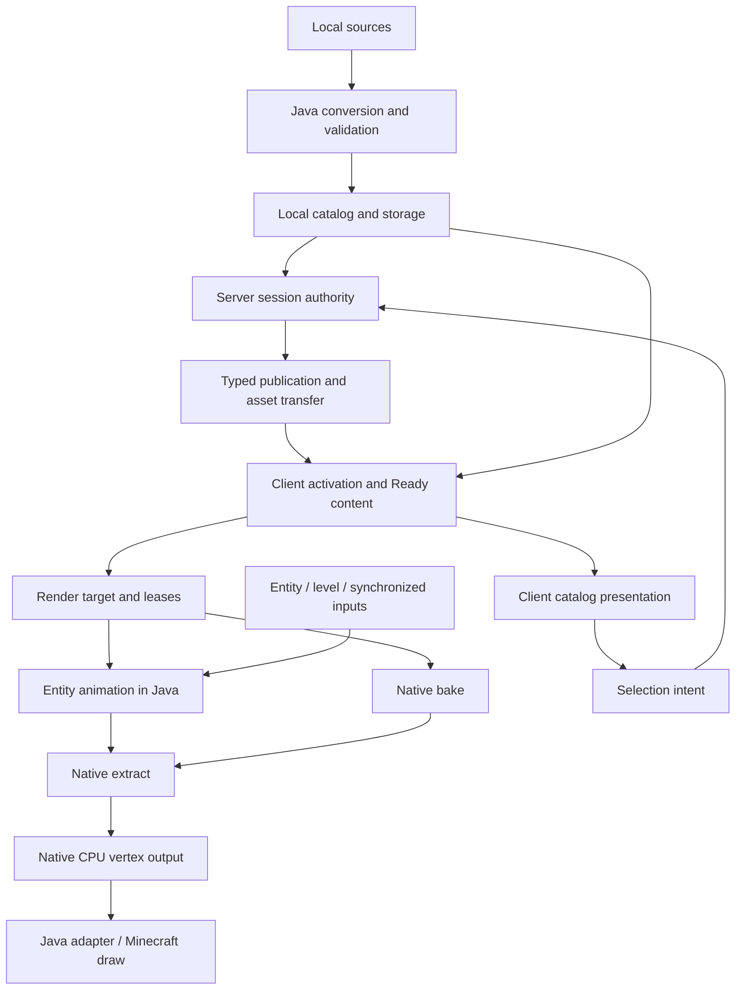

# 架构总览

YSM 的业务权威在 Java 领域层：它决定模型来源、身份、授权、发布、实体动画和资源生命周期。Native 能力层消费明确的 bytes、几何、骨骼状态与输出区间，完成计算后交回结果。Minecraft / Forge 保有游戏事实、连接和 GPU 提交环境。格式、协议与运行行为仍为 **unstable**；业务选择的权威入口是[产品决策树](../product-decisions/README.md)。

文档归约、唯一落点与引用闭环见[架构文档维护规则](maintenance.md)。

## 从问题选择 owner

下表中的 Java 包名均以 `com.elfmcys.ysm` 为前缀；C++ 使用命名空间定位。符号用于找到职责边界，内部方法和数据布局不因此成为公开 API。

| 要解决的问题 | 首读 | 主要定位符号 |
|---|---|---|
| 启动、换服、退出、worker 与 owner thread | [运行模型](runtime-model.md) | `event.CommonEvent`、`ClientModelService`、`ServerModelService` |
| Raw、archive、历史内容如何变成当前模型 | [资产管线](asset-pipeline/README.md) | `format.parser.ModelParser`、`model.catalog.ModelSourceResolver` |
| 元数据可读却不能加载目标资源 | [容器与分层验证](asset-pipeline/container-and-validation.md) | `ModelFileIdentityReader`、`ModelFileView`、`ChunkDataSource` |
| 哪个模型可见、是否 Ready、谁保活资源 | [模型管理](model-management/README.md) | `model.catalog`、`model.session`、`client.model.internal` |
| 哪条连接裁决、分片何时完成、谁调度发送 | [网络](network/README.md) | `network.NetworkHandler`、`network.forge`、`ResourceDispatchWorker` |
| 动画状态、Molang、骨骼输出为何变化 | [动画](animation/README.md) | `AnimatableEntity`、`IAnimationController`、`AnimationProcessor` |
| 几何烘焙、帧调度、顶点或透明排序 | [渲染](rendering/README.md) | `NativeRenderer`、`ysm::bake::BakeModel`、`ysm::renderer` |
| Native 加载、JNI 失败、buffer 或 handle 生命周期 | [Native 运行边界](native-runtime/README.md) | `util.NativeLibUtil`、`natives`、`buffer`、`ysm::java` |
| 模型卡、预览、翻页、选择与页面资源 | [客户端展示](client-presentation/README.md) | `client.gui`、`ClientAssetBatch`、`EntityModelBinding` |
| Forge 接入、第三方扩展、locator 与 render hook | [游戏与扩展接入](integration/README.md) | `api`、`client.compat`、`GeoReplacedEntityRenderer` |

## 主数据流

图中的 remote 路径只在相应 session authority 生效时使用。Local 模式的选择与资源取得见[玩家状态](network/player-state.md)和[Catalog 与来源](model-management/catalog-and-sources.md)。Catalog、activation、render-target Ready 和当前 draw 是不同发布边界，不能由某一阶段成功推断后续阶段已经可用。

## 跨边界约束

- 公共 bytes 的含义由 [Asset Container](../standards/asset-container.md)、[Model Schema](../standards/model-schema/README.md)和[协议](../standards/protocol-v1/README.md)定义；实现页不重新定义 wire 字段。
- 模型身份、精确 representation 与 session authority 彼此独立。对象级关系由[模型管理](model-management/README.md)统一说明，计算层只借用已确定的输入。
- 消费者通过 lease 保活完成资源；临时 native 调用、页面取消和连接退出有各自的生命周期。完整关闭规则只在[所有权与生命周期](model-management/ownership-and-lifecycle.md)定义。
- CPU renderer 不是独立游戏后端，也不提交 GPU draw。Native codec 的存在不等于对应模型功能已接通；支持结论只看[当前支持状态](../status/support-and-verification.md)。

图中相邻模块不意味着可以共同写入同一份 mutable state。
