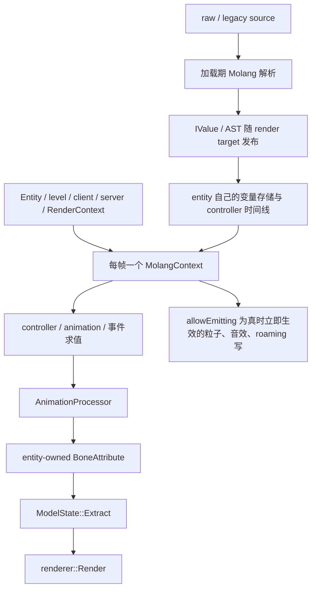

# 动画架构

> **适用问题**：实体动画状态、controller、Molang 解释器、输入同步与 `BoneAttribute` 输出；**不包含**：服务端骨骼计算、模型分发和 native 顶点生成。

本主题描述当前客户端动画运行时。顶层目标见[动画系统](../../concepts/animation.md)；模型内的 Molang 源字段由 [Model Schema](../../standards/model-schema/assets-and-validation.md) 定义，网络 action/event 由[当前网络协议](../../standards/protocol-v1/README.md#expression-action-与本地求值)定义。模型级只读 Molang 资源、实体实例、controller 状态和骨骼输出属于不同生命周期，不能因它们共同服务一次 draw 而合并 owner。

## 责任边界

模型加载把容器中的 Molang 源解析成 AST，随 render target 发布为共享只读资源；`AnimatableEntity` 持有变量存储、controller 与骨骼可变状态，每帧用一个 `ExpressionEvaluator` 遍历这些 AST。服务端只裁决网络状态和 action 主体，客户端 Java 求值，native 消费骨骼输出。解析、binding、事件与 failure 规则统一见[Molang runtime](molang-runtime.md)。

## 数据流

Target 资源可跨 entity 共享；instance、播放进度和 `BoneAttribute` 按 entity 隔离。Generation 切换见[实体与帧状态](entity-and-frame-state.md)，context 复用见[帧执行](../rendering/frame-execution.md)，失败规则见[Molang runtime](molang-runtime.md#失败与信任边界)。

当前实现与验证覆盖统一见[动画已知问题](../../status/known-issues/animation.md)。

## 子主题

- [动画决策理由](design-rationale.md)：派生动画 chunk、完整发布与解析/执行结构分离的复杂度取舍。
- [`AnimatableEntity` 与帧状态](entity-and-frame-state.md)：entity ownership、generation、时间、`RenderContext` 与并发。
- [Controller 与播放](controllers-and-playback.md)：coded、Bedrock、hybrid、状态机、override 与动作提交。
- [Processor 与骨骼输出](processor-and-bone-output.md)：通道合成、复位、`BoneAttribute` 和 native 交接。
- [Molang 运行时](molang-runtime.md)：源解析、binding、事件分发、roaming 与 failure。
- [状态输入与同步](state-inputs-and-sync.md)：输入权威、PlayerState、Roaming、config action 与 `ysm.sync`。
- [模组动画联动](../../future/mod-animation-integration.md)：尚未收敛的适配边界与验收条件。

## 定位与交接

`com.elfmcys.ysm.molang` 承载 lexer、parser、AST 与 `ExpressionEvaluator`；`com.elfmcys.ysm.geckolib3.core.molang` 承载 controller/query binding、变量存储与原版 query 变量；`com.elfmcys.ysm.client.animation.molang` 承载 YSM 自有 binding、函数、roaming struct 与事件包装；`com.elfmcys.ysm.geckolib3` 承载 controller、processor、动画/物理状态和输出；`client.controller` 与 `client.compat` 提供 coded controller 和可选模组输入。

| 问题 | 先定位的设计对象 |
|---|---|
| Molang 源没被解析、解析后退化为常量或模型加载失败 | `CustomMolangParser`、`MolangParser`、`AnimationProtoMapper`、`ModelRenderTargetLoader` |
| 换模后变量、defer 或效果进入错误状态 | `EntityModelBinding`、`AnimatableEntity`、`AnimationProcessor`、`AnimationContext` |
| Minecraft query、可选模组输入或效果路由错误 | `PrimaryBinding`、`QueryBinding`、`YSMBinding`、`CtrlBinding` |
| Animation 选择、转换或混合 | `IAnimationController`、`AnimationPlayer`、`AnimationProcessor` |
| Java 输出正确但姿态或 locator 错误 | `BoneAttribute`、`GeoModelState`、`ModelState::Extract` |

把容器源解析成正式 AST 属于模型加载与[资产转换](../asset-pipeline/conversion-and-export.md)；render target 的发布与 Ready 见[模型管理](../model-management/README.md)。Forge/第三方接入窗口见[游戏与扩展接入](../integration/README.md)，动画 worker 与 render thread 的交接见[运行模型](../runtime-model.md)。
