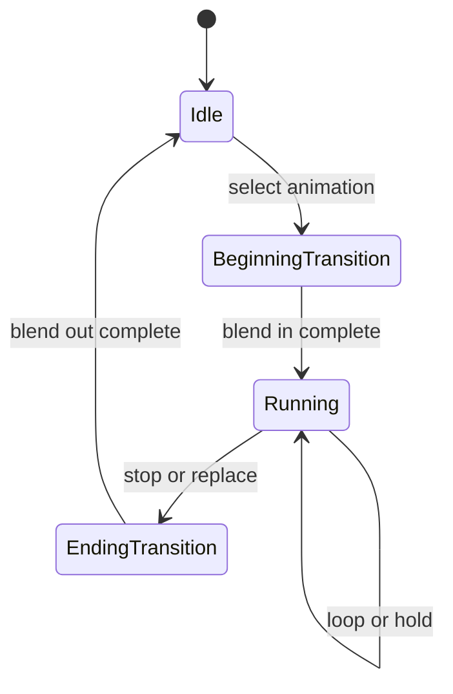

# Controller 与播放

`IAnimationController` 把语义状态映射为一个或多个 animation player，并管理进入、运行、退出、转换与混合。当前存在三种组合方式：

| 类型 | 职责 |
|---|---|
| `CodedAnimationController` | 用客户端实体语义选择内建动作，适合作为基础移动、姿态和交互行为 |
| `BedrockAnimationController` | 执行模型声明的状态、transition、条件 animation、嵌套 controller 和进入/退出动作 |
| `HybridAnimationController` | 允许模型 controller 覆盖某个语义槽，未覆盖时委托给 coded controller |

Hybrid 只改变动作来源，不改变最终 processor、entity 的 Molang 状态或骨骼输出契约。

## 播放状态

Player 支持循环、单次播放和保持末帧。选择与当前相同的 animation 不会隐式重启；显式 reload 或状态重置才重建时间线。目标 animation 不存在时回到 idle，不以随机 fallback 掩盖资源错误；render target 不可用时的系统级回退另见[默认模型](../model-management/default-model.md)。Coded controller 还可返回继续、暂停或停止，用于区分推进时间、保持当前值和结束播放。

## Bedrock 状态机

- 从声明的 default state 开始；每次按声明顺序检查 transition，第一个成立者获胜。
- 一个 state 可以按条件激活多个 animation，结果进入同一 controller 的混合流程。
- 空 state 可以继续跳转，但必须检测环路，避免单次更新无限迁移。
- State 可以引用子 controller；嵌套仍服从同一实体时间线、Molang 上下文与副作用门禁。
- On-entry、on-exit 与 instruction keyframe 是动作阶段，不属于连续骨骼采样；重复求值不能无条件重复触发。

Animation 和 controller 的名称、引用、时间单位与 wire 约束见 [Model Schema](../../standards/model-schema/assets-and-validation.md)，本页不复制字段结构。

## 单个 controller 的求值

求值依次选择状态/语义槽、推进 player 与 transition、采样并在 controller 内混合，最后发布 bone queue。

`AnimationPlayer` 按播放模式、当前时间和 transition 权重采样 rotation、position 与 scale；关键帧分量和条件在模型加载期已解析为 AST，求值时只传入本次 player/context 输入，不重新解析源文本。单 controller 的结果形成 bone queue，跨 controller 的顺序、覆盖与复位由 [`AnimationProcessor`](processor-and-bone-output.md) 负责。

## Coded controller override

模型可以为 coded controller 声明 override handler：controller 名中的 `.` 换成 `_ctrl_` 后作为事件名，取该事件下声明顺序的首个 handler。该 handler 无参数、返回 `F32`，精确 `2`、`3`、`4` 分别覆盖为继续、停止、暂停；handler 缺失、`5` 或其他值都委托 Java predicate。求值期间允许产生效果，失败与效果门禁见[Molang runtime](molang-runtime.md#失败与信任边界)。

## 副作用阶段

主时间线触发 instruction keyframe，真实 state transition 触发 on-entry/on-exit；其他 `RenderContext` 重算走 observation。它们使用[Molang runtime 的门禁与失败规则](molang-runtime.md#失败与信任边界)，实机覆盖见[动画已知问题](../../status/known-issues/animation.md)。

## 声音触发与宿主播放

Instruction sound keyframe、controller-state sound effect 与 `ysm.play_sound` 进入同一 entity/controller `SoundInstanceManager`。带 `:` 的 selector 按 Minecraft namespaced sound id 继续走宿主 `SoundEvent`；不带 `:` 的 selector 在当前 render target 的 immutable sound map 中精确查找，找不到只拒绝该次声音。相同 tick 的不同作者事件按声明顺序各自触发；只有主时间线拥有 effect 能力，额外 render observation 不重复发声。

模型声音每次触发建立独立 playback，通过[客户端音频保留](../model-management/storage-and-cache.md#客户端音频保留)按需取得完整 verified bytes，并统一交给 Minecraft `AudioStream`；PCM 命中不改走 complete-buffer cache。Entity/controller reset、model clear、离开 world、runtime disconnect、脚本 stop 和 host release 都通过本次播放 owner 收敛，具体 ownership 见[模型音频生命周期](../model-management/ownership-and-lifecycle.md#模型音频生命周期)。音量、pitch、定位、loop 消费、streaming channel 容量和设备生命周期仍由 Minecraft host 拥有；满池可拒绝新触发，YSM 不排队、抢占、扩容或恢复后补播。

## 指令区间推进

按[指令因果契约](../../product-decisions/decisions/animation-sampling.md#bcinstruction-keyframes-preserve-causality)，离散指令沿主时间线经过的区间执行，不能只处理最终骨骼采样点。
