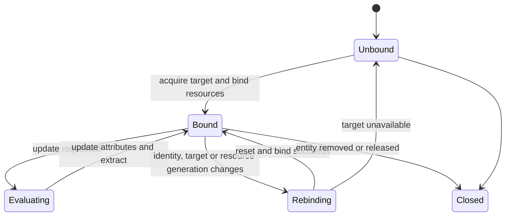

# `AnimatableEntity` 与帧状态

`AnimatableEntity` 是客户端 `Entity` 的动画生命周期根，不是网络 DTO，也不是 native model。它把共享模型资源绑定到一个 `entity`，串联输入、controller、entity 自己的 Molang 状态、processor 与渲染输出。

## 实体级所有权

| 状态 | 生命周期与用途 |
|---|---|
| 模型绑定与 lease | `EntityModelBinding` 指向当前 render target，并保证解析资源、烘焙几何和纹理在使用期间存活 |
| controller 集合与时间线 | 保存各 controller / player 的状态、播放进度、转换和上次逻辑时间 |
| `AnimationProcessor` | 保存骨骼 snapshot、active bone 与通道复位状态，并写入模型拥有的 `BoneAttribute` |
| Molang 状态 | 由 `AnimationProcessor` 持有的 `MolangMemory`（`v` scoped 变量与当前 roaming struct 引用、`t` 临时槽）以及 animation player 上的 defer 参数缓冲；这些状态都按 entity 隔离 |
| `Entity` 输入状态 | 跟踪 tick、移动、`Pose` 和网络投影，用于计算连续输入 |
| 输出槽 | 保存 canonical 或按 `RenderContext` 分区的 mutable `GeoModelState`；其 native 状态拥有 pose / normal 存储，Java 保存借用 view 和 locator 映射 |

模型 animation、controller、用户函数、事件 handler 与解析后的 AST 是 target 级只读资源；上表的可变状态按 entity 隔离。骨骼数组由[Processor](processor-and-bone-output.md)写入，输出槽与 view 借用由[帧执行](../rendering/frame-execution.md#输入输出与状态)定义。

## 绑定与切换

Model switch、Molang 求值（含 defer 排空）与 close 在同一 entity owner barrier 内串行；跨线程提交的表达式经 processor 的队列在下一帧汇合，GC 不充当逻辑关闭信号。

同一 render target 内的纹理或兼容变体可通过 `AnimatedGeoModel.setModelInplace(...)` 保留 controller、Molang 变量状态、roaming struct 引用、物理与时间线，并在等待既有任务后替换渲染资源。第一人称手臂只可显式共享主模型的 roaming struct，普通 entity 之间不共享 `v` 变量存储。模型身份、target 或资源代次改变时，先准备新资源，再在 entity owner barrier 内切换 current eligibility、丢弃旧状态（`MolangMemory` 的 scoped 变量、defer 缓冲与 roaming 引用），最后关闭旧 lease。已进入旧 barrier 的调用要么在资源仍 current 时完整结束，要么成为 stale/closed；效果在 `allowEmitting` 为真时已经立即作用于宿主，没有可丢弃的暂存提交或回滚点。是否保留必须由完整资源兼容性决定，不能只凭用户路径或短 hash 推断。

## 时间与更新频率

时间语义受[animation-sampling](../../product-decisions/decisions/animation-sampling.md)与[重复观察隔离](../../product-decisions/decisions/animation-isolation.md)约束。主更新推进时间线，其他 pass 仅观察；区间指令处理见[Controller](controllers-and-playback.md#指令区间推进)。

按 tick 采样后逐帧插值仍是可选后续优化方向，不能把它记为当前已切换的运行方式；任何调度变化都须维持上述语义。

动画使用单调逻辑时间；观察到时间倒退时夹紧而不反向推进 controller。常规 `level` 中的 `entity` 可按可见性、距离和负载降低更新频率，但每次求值仍以累计逻辑时间推进，不能把跳帧误作暂停。需要即时交互或不同姿态语义的 `RenderContext` 走同步更新。

`AnimationParallelTicker` 会在正式 draw 前预调度符合条件的 `level` entity。`AnimationEvent` 携带 `partialTick`、`RenderContext` 和 `entity` 动画数据，但不会冻结查询所读的全部对象。每个 `entity` 同一时刻只允许一个动画任务；渲染消费、换模和释放都必须等待该任务完成。

## Canonical 与 mutable 输出

不同输出槽隔离 Extract 结果，仍共享 entity 的 controller、Molang 状态与 `BoneAttribute`；独立播放进度需要独立 `AnimatableEntity`。Canonical 复用、mutable context 和逐 draw metadata 的规则统一见[帧执行](../rendering/frame-execution.md#java-预调度与-context)。

## 输入与副作用边界

Molang 求值的 observation/action 门禁与失败规则见[Molang runtime](molang-runtime.md#失败与信任边界)。当前仍直接读取部分 live Minecraft/optional-mod object，线程安全与 surface 验证见[动画已知问题](../../status/known-issues/animation.md)。

骨骼结果到 native 的借用、失败失效和 render 串行要求见[Processor 与骨骼输出](processor-and-bone-output.md)及[逐帧状态与调度](../rendering/frame-execution.md)。
