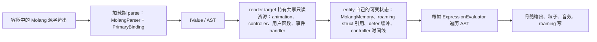

# Molang 运行时

Molang 是 YSM 的 authoring/import language，也是正式模型内的运行时表示：容器把每个 execution 字段编码为 `mixel.common.Program` 信封，本工程只写、也只读 `format = 0` + `source`，加载期由 in-Java 解释器把 `source` 解析成 AST，求值期直接在 AST 上遍历。`Program` 的 oneof 另有 `bytecode`（field 2）分支，它保留给已移除的 AOT 引擎：本工程从不生产也不消费，因此当前不存在第二套执行语言，也没有转译产物、artifact store、host ABI 或 interpreter fallback，也没有为兼容旧机制保留的执行分支。lexer、parser 与 `ExpressionEvaluator` 在 `com.elfmcys.ysm.molang`，binding、context 与变量存储在 `com.elfmcys.ysm.geckolib3.core.molang`，YSM 自己的 binding、函数与 roaming struct 在 `com.elfmcys.ysm.client.animation.molang`。

## 源码、解析与缓存

容器中的 execution 字段是 `Program` 信封，信封内承载 Molang 源文本或 literal，不是 bytecode：

| 位置 | Wire 形状 |
|---|---|
| 骨骼关键帧分量 | `BoneKeyFrame.pre`/`post` 是 `repeated ExpressionValue`；`ExpressionValue` 的 oneof 是 `float num = 1` 或 `common.Program program = 2` |
| instruction keyframe | `InstructionKeyFrame{ common.Program programs = 1; float start_tick = 2; }`；`programs.source` 是该帧有序 statement 拼成的单条源文本 |
| animation | `Animation.loop` 是 `optional LoopType`，`blend_weight` 是 `optional ExpressionValue` |
| animation controller | `AnimationController.default_state` 是 `optional string`；`State.animations` 是 `repeated AnimationReference{ string name = 1; common.Program condition = 2; }`；`Transition.condition` 是 `common.Program`；`State.on_entry`/`on_exit` 是 `optional common.Program`；`State` 不再有 `blend_via_shortest_path`（field 7 未使用），field 8 是 `sound_effects` |
| 用户函数 | `mixel.asset.strings.data.UserFunction{ string name = 1; common.Program body = 2; }` |
| config form | `mixel.manifest.info.ConfigForms{ common.Program read_program = 4; repeated ConfigLabel labels = 8; common.Program write_program = 9 }`；`ConfigLabel{ string name = 1; common.Program action_program = 2; }` |

`Program` 由 `common/program.proto` 定义，是模型容器与 Native projector 共享的 wire：`format` 在本工程恒为 `0`（生产者只显式写 `source`，`format` 取 Proto3 默认值），`bytecode` 只占 tag（field 2），生产路径不写、消费路径也不解释，因此没有需要解释或校验的编译产物。语句列表按 `SourcePrograms.statements` 拼接：先追加原始语句，若其最后一个非空白（空格/TAB/CR/LF）字符不是 `;` 则补 `;`，再补 `\n`；Native projector 用同一算法，两侧对同一 statement 列表产出相同 bytes。

模型内容的解析只发生在加载期。`ModelRenderTargetLoader` 与 `AnimationProtoMapper` 为一次加载租用 `CustomMolangParser` 的 `MolangParser` 实例，把每个位置的 `Program.source`（literal 分量走 `ExpressionValue.num`）解析为 `IValue`，解析结果随 render target 资源一起保留：`MolangValue` 持有 `List<Expression>`，`Animation` 与 controller state 持有这些 `IValue`，`CommonAsset` 持有用户函数表与事件 handler 表。求值期只遍历这些 AST，不重新解析源文本。

`CustomMolangParser` 用 `ConcurrentLinkedQueue` 池化 `MolangParser`，归还时 `reset()` 清空 scoped/transient 状态，避免为每个模型重建 parser 与 binding 集合。`MolangEngine.fromCustomBinding` 是解析入口，`PrimaryBinding` 在每次创建 parser 时装配全部根 binding。根名称与它的第一个 `.` 成员在解析期就解析成具体对象（`math.sqrt`、`ysm.bone_rot`、`v.xxx`），更后面的 `.` 变成 `StructAccessExpression`，求值期按 pooled 句柄访问结构体，因此热路径不按名称查找 binding。名称在解析期注册进进程级 `StringPool` 并只以 int 句柄参与后续访问；该表只增不删，长会话下的规模没有单独测量。

`BuiltinModelMaterializer.bindCommonStrings` 在 builtin 模型物化时把所有内建用户函数走一遍解析并丢弃结果；由于 `parseExpression` 会吞掉解析失败，这一步不构成内容校验。

## 模块与发布流程

一个 render target 是解析结果的发布单位：加载期把容器内容解析成 AST 并装配进 `ModelRenderTarget`，随 manifest、结构校验和资源一起原子发布，然后才允许 entity 绑定；发布与 Ready 门的其余部分由[模型管理](../model-management/README.md)拥有。这里没有独立的 Molang module、program catalog、host registry 或 artifact 需要闭合，需要闭合并随 target 一起失败的只有解析本身。

解析结果按 render target 共享且只读，entity 只创建自己的可变状态：`AnimationProcessor` 持有 `MolangMemory`、随机源、音效管理与 pending Molang 任务队列，controller 与 animation 持有共享 AST，`ExpressionEvaluator` 只是每帧的临时对象。模型切换、换纹理或替换资源时，旧 target 的 AST 与新 target 的 AST 不共享 parser 状态。

## Binding 与 invocation

`AnimationProcessor.tickAnimation` 每帧构造一个 `MolangContext`（当前 entity、`AnimationEvent`、`MolangMemory`、`RandomSource`、音效管理）和一个 `ExpressionEvaluator`，本帧所有 controller、keyframe 与事件共用它们。求值单位是「entity × 帧」，不是每条表达式一个执行对象。

`PrimaryBinding` 装配下列根名称；未解析到对象的名字在解析期就抛 `ParseException`（模型内容走安全路径时退化为常量 `0`），不会留到求值期做兜底：

| 根名称 | 承载对象 | 语义 |
|---|---|---|
| `math` | `MathBinding` | 内建数学函数 |
| `query` / `q` | `QueryBinding` | Minecraft query，值按当前 context 直接读取 |
| `ysm` | `YSMBinding` | YSM 自有函数、变量与效果入口；可选模组 binding 在自己的 compat 类注册 |
| `ctrl` | `CtrlBinding` | coded controller 状态与语义槽判定 |
| `tlm` | `TLMBinding` | 女仆联动的可选 binding，未安装时仍存在以保证动画不报错 |
| `fn` | `UserFunctionBinding` | 用户函数按名调用；每个 parser 实例一份，不能单例 |
| `args` | `UserFunctionArgument` | 用户函数实参视图 |
| `v` / `variable` | `ScopedVariableBinding` | entity 级变量，落在 `MolangMemory` 的 scoped 存储 |
| `c` / `context` | `ContextVariableBinding` | 当前 animation/controller context 的局部变量 |
| `t` / `temp` | `TempVariableBinding` | 单次求值期的临时槽，按 int 地址访问 `StackMemory` |
| `loop` / `for_each` | `StandardBindings` | 循环与遍历，循环次数上限 `1024` |

值本身带类型校验：`EntityVariable`、`LivingEntityVariable`、`PlayerVariable`、`LocalPlayerVariable`、`ProjectileVariable` 等只在当前 `IContext.entity()` 是相应类型时求值，否则返回 `null`；`ContextFunction` 同理。`MolangContext.createChild` 在变量指向另一个对象（如投射物 owner）时构造子 context，使 query 继续读对应实体的数据。嵌套用户函数调用与 `t` 槽共用 `StackMemory`，栈深上限 `32`，超限时 `callUserFunction` 返回 `null`。

`allowEmitting` 是 context 上的效果门禁，由调用方在求值前后设置：事件 handler、instruction keyframe、controller on-entry/on-exit、coded controller predicate 与显式命令传入 `true`，其余观察性遍历保持 `false`。粒子、音效、骨骼着色/发光/透明与 `ysm.sync`、`ysm.defer` 都先检查它，为假时直接返回 `null`。它只覆盖这些效果入口，不覆盖 `ysm.set_animation`、`ysm.reset_controller` 这类直接改 controller 状态的函数，也不构成事务。

`v` 变量的存储是 entity 自己的 `MolangMemory`：`AnimationProcessor.clearModel()` 调 `MolangMemory.initialize(null)` 清空 scoped 表，其中的 roaming struct 引用随之丢失，由下一帧的 `putRemoteStruct` 重新写入；`IForeignVariableStorage` 指向同一份 scoped 存储，供 compat 读写模型变量。

## Event 与 handler 分发

用户函数名里 `@` 之后的后缀决定它挂在哪个事件上：`ModelRenderTargetAssembler.buildEventHandlers` 把 `name@eventType` 收起为小写 `eventType` 键下的 handler 列表，同时把 `@` 之前的部分注册为可调用用户函数。这里没有 closed catalog 与 typed role：未知后缀只会成为一张永远不会被取用的表项，既有 coded controller discovery 也只按约定的后缀名查找。

| 事件 | 触发点与参数 | 顺序与门禁 |
|---|---|---|
| `player_init` | `CustomHumanoidEntity.preAnimationSetup`，每次装载 geo model 后触发一次，无参数 | 以 pre 任务入队，`allowEmitting = true` |
| `player_update` | 同处每个更新帧，第 0 个参数是本次是否推进的 bool | 以 pre 任务入队，`allowEmitting = true` |
| `sync` | `ysm.sync(...)`：本地玩家在远端通道存在时发 `emitMolangSync`，否则回调 `molangSync` 本地触发本模型 handler | 单次调用参数上限 `16`，以 post 任务入队 |
| `defer` | `ysm.defer(name, ...)`：第 0 个参数只用于非空判断、不参与分发，其余已求值参数被拷贝进当前 `AnimationContext` 的缓冲 | 在 `AnimationContext.reset` 时按捕获顺序**逆序**排空，每个 handler 调用期间 `allowEmitting = true` |
| coded controller override | `CodedAnimationController.updateModel` 把 controller 名中的 `.` 替换为 `_ctrl_` 后取出该事件下的首个 handler 作为 predicate | 求值期间 `allowEmitting = true`；结果精确为 `2`/`3`/`4` 时覆盖为继续/停止/暂停，其余值（含 `5`）与 handler 缺失都委托 Java predicate |

handler 的实际调用走 `MolangEventWrapper.wrap(...)`：它把 handler 列表包成一个 `IValue`，在求值时交给 `IContext.callUserFunction`，由 `StackMemory` 压入参数视图再求值。`defer` 是唯一跨调用保留参数的事件；它保存的是求值后的参数对象，不做有限数校验，也没有显式项数上限，缓冲数组随 animation player 复用，`AnimationContext.reset` 只把计数归零。排空时机绑定在 controller/player 的 `finalizeAnimationContext`（on-exit/on-entry、状态切换、循环重置）上，而 effect 在排空时立即生效，没有后续提交点。

## Roaming 所有权与同步

Roaming 变量是跨玩家可见的模型自定义状态，所有权分三层：

| 层 | Owner 与形态 |
|---|---|
| 服务端权威 | `ModelInfoCapability` 的 `RoamingVariableStore`，按 `roamingHash` 保存名称到 float 的值 |
| 客户端会话 | `PlayerAnimatableCapability` 的 `ClientRoamingSession`，按 `roamingHash` 保存 `RemoteStorage`，并持有当前模型的 `currentStruct` |
| 模型可见结构 | 本地玩家是 `LocalRoamingStruct`（可写、记录变更），其他玩家与投射物/载具是 `RemoteRoamingStruct`（只读为主） |

模型文本通过 `v.roaming.<name>` 读写它：每次推进动画前，玩家、投射物/载具与第一人称手臂分别调用 `AnimationProcessor.putRemoteStruct`，把 struct 写进 `MolangMemory` 的 scoped 存储（名字固定为 `roaming`）；写操作最终落到 `Struct.putProperty`，名称以 `StringPool` int 句柄索引。

本地写与上行：`LocalRoamingStruct.putProperty` 把值按 float 归一，值未变化时不记录；新名称计入名称集合，集合超过 `MAX_SIZE`（64）后仍会写入值但不再记录为变更；发生变化的项进入 `VariableChanges` 并置 dirty。`PlayerAnimatableCapability.handleRoamingVarsChanges` 调 `flushLocalChanges`：仅本地玩家、hash 非 0 且 dirty 时弹出变更，同步给所在载具，丢弃超过 `MAX_NAME_LENGTH`（32）的名称，再经 `ClientProtocolGateway.reportRoamingChanges` 上报；`PlayerStateReportPlanner` 决定该次上报是完整段还是增量段，wire 形状是 `RoamingState{model_key, variables}`。

下行与远端：`PlayerStateHandler` 按段应用——完整段走 `resetRoamingVars`（`ClientRoamingSession.resetFromServer` 整体替换该命名空间的值、合并该命名空间在基础值到达前排队的 pending 变更，并在本地玩家情况下重建 struct 并重载模型），增量段走 `updateRemoteRoamingVars`（`updateRemote`，对本地玩家和空变更直接丢弃，否则合并，基础值未到时先排队，并转发给所在载具）。上报端按「self FULL 绑定命名空间」理解：self FULL 缺失 roaming 段时，命名空间由该模型自己的 `roamingHash` 给出，表示它为空而不是未知。

快照与生命周期：`roamingSnapshot` 在请求的命名空间等于当前命名空间且当前 struct 是 `LocalRoamingStruct` 时直接复制实时值，否则复制该命名空间已存的值；`modelReset`、`geoModelReset` 与 `clearFromServer` 分别把 hash 归零、struct 置 `null`、清空全部命名空间。投射物与载具的 capability 各自持有 `RemoteRoamingStruct` 字段并在每帧 `preAnimationSetup` 重新推入 processor；第一人称手臂显式推入主模型 entity 的 struct，普通 entity 之间不共享 `v` 变量存储。

## 失败与信任边界

失败按发生阶段分层，当前实现没有 program 级失败记忆、没有 batch/rollback，也没有 generation lease：

| 失败 | 结果 |
|---|---|
| 加载期解析失败、arity 不合法或缺 binding 名 | `MolangParser.parseExpression` 捕获后返回常量 `0`（`FloatValue.ZERO`），按 debug 级别记日志；只有开启调试动画屏时升级为 error 并打印原文。受影响位置退化为常量，模型其余部分继续发布，不逐帧重试 |
| 需要显式反馈的 ingress 源（command、watch、config 编辑、网络执行） | 走 `parseExpressionUnsafe`，`ParseException` 抛给调用方，由其报错或忽略；失败不产生执行 |
| 求值期抛出的异常 | `IValue.eval` 捕获所有 `Throwable`，按 debug 级别记日志并返回 `null`；`evalAsFloat`/`evalAsInt`/`evalAsBoolean` 再把 `null` 归一为 `0`/`false`。入队任务在 `AnimationProcessor.executeMolangTask` 另有外层捕获，把 `"Error: ..."` 文本交给结果回调并保证清掉 `allowEmitting`。没有禁用位、失败记忆或重抛：异常不针对具体表达式保留状态，也不影响后续帧 |
| NaN | 每次数值转换都归一：`ValueConversions.asFloat`/`asDouble` 把 NaN 变成 `0`，`asBoolean` 把 NaN 当假。Infinity 不做归一，按原值参与计算 |
| 除零、数组越界、结构体访问、非法赋值 | 除零按 Molang 语义返回 `0`；数组下标小于 `0` 夹到 `0`，越界返回 `null`；对非 struct 取成员返回 `null`；赋值左侧不可赋值时静默忽略 |
| 用户函数缺失或调用栈超深 | 打印一次未找到并按调用点缓存，之后直接返回 `null`；栈超过 `32` 层时 `callUserFunction` 返回 `null` |
| 效果失败 | 效果在 `allowEmitting` 为真时立即作用于宿主；已经生效的粒子、音效或 roaming 写不会因为同一帧后续失败而回滚 |

信任边界：模型与网络都不能注入 Java 或选择执行后端，只能提供 Molang 源文本。远端执行入口 `ExecuteMolangEvent` 的源长度与目标数都有界，客户端收到后按需解析并交给目标 entity 执行；解析本身不赋予任何超出 `allowEmitting` 与当前 entity 能力的效果权限。

## Privileged ingress

显式 ingress 直接复用同一套解释器，只是源来自会话而非模型：

- 客户端命令与 watch：`MolangCommand`、`SimpleWatchCommand` 用 `parseSingleExpressionUnsafe` 解析命令里的源，装进调试表达式列表，每帧作为 pre/post 任务求值（`allowEmitting = false`），解析失败回报命令发送者。
- config form：控件打开时求值 `ConfigForms.read_program.source` 取得当前值；`FlatSlider` 与 checkbox 在交互时把 `read_program.source + "=" + uiValue` 拼成一段源再解析，以 post 任务执行（`allowEmitting = true`），并在不是纯 `v.roaming.*` 赋值时提交给周围玩家；radio 的每个 label 直接执行 `ConfigLabel.action_program.source`，完成后以同一 post 队列重新求值当前 panel 的全部读表达式，并在 Minecraft thread 原位更新仍属于当前 screen 初始化周期的控件。
- 网络执行：服务端下发的执行消息在客户端按目标 entity 解析并执行，`allowEmitting = true`。

这些入口没有任何独立 session、lease 或持久化写回概念，也没有按目标 generation 绑定或回收的编译产物：它们与模型内容共用同一个解析器池和同一个求值器，执行完即结束。是否允许产生宿主效果仍由 `allowEmitting` 决定，是否允许写模型状态取决于写的是哪一类变量。

## Bounds 与热路径

当前实现的确定性上限：

- `loop`/`for_each` 的循环次数上限 `1024`（`StandardBindings.MAX_LOOP_ROUND`）。
- 用户函数与 `t` 槽共用 `StackMemory`，栈深上限 `32`；深层调用返回 `null` 而不是抛错。
- 函数 arity 在解析期用 `Function.validateArgumentSize` 校验，不合法即 `ParseException`。
- `ysm.sync` 单次调用参数上限 `16`，上行包同样限制 `16` 且要求所有参数是有限浮点。
- Roaming：`LocalRoamingStruct.MAX_SIZE = 64`、`MAX_NAME_LENGTH = 32`，wire 侧另有 `ProtocolLimits.MAX_ROAMING_VARIABLES = 64`。
- 网络执行入口：源长度上限 `4096`、目标数上限 `1024`（提交 roulette 表达式时同样限制源长度）。

没有对应预算的部分需要显式说明，不能按旧文档推断：解析器与求值器都没有 bytes/节点/嵌套深度预算（深嵌套源文本或表达式的递归只受 JVM 栈约束，溢出会被 `IValue.eval` 当成普通失败吞掉），`StringPool` 与 entity 的 scoped 变量表随名称数量单调增长，`pendingMolangTask` 队列无界且每帧排空一次，`defer` 缓冲没有项数上限也不校验有限数，interpreter 也没有求值步数预算。

热路径上每帧只构造一个 context 与一个 evaluator，之后是纯 AST 遍历：不解析源文本、不做 binding 名称查找、不构造 registry、不反射、不做 codegen 或 artifact I/O；`t` 槽按 int 地址访问，结构体成员按 `StringPool` 句柄访问。`fn.<name>(...)` 是唯一的例外——首次调用按名称从当前 model 解析用户函数，并按调用点缓存。所有 cold/warm/hot 延迟、分配与 tick/render 影响的实机测量仍然缺失：结构上只是「解释了」而不是「编译过」，不能据此推断主循环成本，也不存在任何支持「已 AOT、因此更快」的结论。

## 当前验证边界

结构验证、语言差异与 Forge 实机验收的覆盖范围统一见[动画已知问题](../../status/known-issues/animation.md)。
