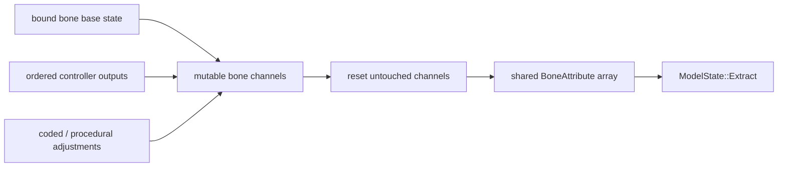

# Processor 与骨骼输出

`AnimationProcessor` 是 controller 与 renderer 之间的合成层。它维护模型基准 snapshot、active bone 与复位状态，依次运行 controller，并写入 `AnimatedGeoModel` 的 `BoneAttribute` 数组。这里的 active bone 是仍受动画或复位驱动的骨骼，不等同于 Extract 产生的可见 render-bone 集。

## 处理流程

绑定阶段按 `BakedModel` 的骨骼 preorder 建立稳定映射，使 Java attribute 与 native hierarchy 使用同一顺序。动画资源绑定及其 Java cache 不是 renderer 的 geometry bake，也不能替代 `BakedModel`。

更新使用模型基准、上次连续状态和本次逻辑时间。Controller 按稳定顺序合成，其冲突结果共同受 blend 与 transition 进度影响；未驱动通道渐进复位。正常路径逐骨骼原位写入共享数组再同步 Extract，当前没有事务式 staging、回滚或模型 revision 复核。

## `BoneAttribute`

| 通道 | 逻辑含义 |
|---|---|
| `rotation` | 已包含模型初始旋转的最终局部旋转 |
| `position` | 相对模型基准的局部动画位移 |
| `scale` | 局部缩放 |
| `cubes_hidden` | 隐藏当前骨骼的几何与 locator，不必隐藏后代 |
| `children_hidden` | 保留当前骨骼，但跳过后代层级 |
| `locator_sequence` | 绑定时写入的静态 locator 标记，用于 Extract 选择附着点输出 |
| `color` | packed RGB 乘色；默认 `0xFFFFFF` |
| `transparency_glow` | packed alpha 与 glow；alpha 默认 `255`，glow 的 `0xFF` 表示保留上层 light |

`BoneAttribute` 只表达局部骨骼语义，不包含最终 position / normal matrix、可见面、顶点偏移或 GPU 状态。层级组合、非法数值处理和可见性遍历由 [Extract](../rendering/frame-execution.md) 统一完成。

颜色、透明度和 glow 都是当前骨骼自身的属性，不随 pose 层级向后代继承。RGB 合成公式见[顶点输出](../rendering/vertex-output.md)。三个属性由 expression action 原位更新并跨帧保留，直到再次写入或建立新的 `AnimatedGeoModel`；兼容的 `setModelInplace(...)` 不重置它们。Java 以两个可由 float 精确表示的整数槽保存 `r | g<<8 | b<<16` 和 `alpha | glowByte<<8`，不使用 raw float bits。

## Native 交接

`AnimatedGeoModel` 持有一份 entity 级 `BoneAttribute`，同步 Extract 临时读取它，生成所选 `GeoModelState` 输出槽。Native 不保留 attribute，也不修改动画状态；输出所有权、借用有效期、失败失效与并发维度统一见[逐帧状态与调度](../rendering/frame-execution.md)。

Packed 布局是内部实现契约，由单一版本门禁和测试约束；当前属性语义与 context 复用差异见[动画已知问题](../../status/known-issues/animation.md)。
