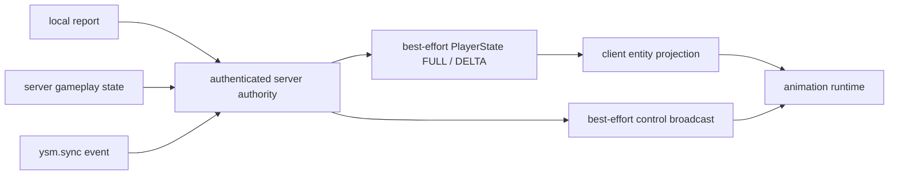

# 状态输入与同步

动画运行时消费的是客户端可见状态的投影。服务端为联网玩家状态的权威，但不求值 animation、controller 或骨骼；客户端把权威投影与本地 `Entity`、输入和 `RenderContext` 合并后完成动画。

## 输入分类

| 输入 | 典型内容 | 权威与用途 |
|---|---|---|
| `Entity` 观察 | tick、位置与位移、`Pose`、骑乘、生命状态、行走、身体与头部方向 | 客户端 `level` 中的当前事实，用于连续动作与姿态 |
| 服务端 PlayerState | 模型选择、gameplay / effects、额外动画、远端操作轴、Roaming | 经 exact connection 与内容验证的 best-effort 联网投影 |
| `Minecraft` | 键鼠、相机、`level` 与 `LocalPlayer` 状态 | 只用于本地动画或构造受限报告，不能自行成为服务端权威 |
| `AnimationEvent` / `RenderContext` | `partialTick` / `level`、GUI、第一人称、pass 与视角差异 | 分别提供采样时刻，以及姿态语义与输出复用条件 |
| 模型资源 | animation、controller、用户函数、config form 与骨骼绑定 | 加载期解析出的 `IValue` AST 与 binding 句柄；不携带 Minecraft object 或 JVM artifact |
| 兼容适配 | 可选模组的动作、装备、载具或相机状态 | 主线仍有若干直接接线，但大量联动未迁入；既有接线也未统一改造和验收 |

`LocalPlayer` 和 `RemotePlayer` 的数据来源不同，但进入 controller 前应归一为明确的逻辑输入。当前查询仍散布在运行时并直接读取 live 对象，尚未形成统一快照，见[实体与帧状态](entity-and-frame-state.md)。

## 状态与事件

Roaming 随 PlayerState FULL/DELTA 的到达机会累积；消息没有 revision、ACK、重放或顺序保证，合法遗漏、重复与延迟可造成投影漂移。`ysm.sync` 是瞬时事件，产品边界见[script-sync](../../product-decisions/decisions/script-sync.md)，消息限制见[当前协议](../../standards/protocol-v1/README.md)。

## Roaming

Roaming 是模型作用域内、可跨帧和 controller 使用的一组 float 变量，通过 `v.roaming` 暴露给 Molang。加载期为每个 target 解析出 struct 定义，entity 侧持有对应的 `LocalRoamingStruct`／`RemoteRoamingStruct` 实例状态。

- `ClientRoamingSession` 按模型派生的 32-bit `modelHash` 保存网络投影与当前 struct；`LocalRoamingStruct` 记录本地写入并置 dirty，`RemoteRoamingStruct` 承载远端／投射物／载具值。
- `LocalPlayer` 使用 producer role：roaming 赋值直接写 struct 并置 dirty，`flushLocalChanges()` 取出变更后经 `ClientProtocolGateway.reportRoamingChanges` 交付；服务端 FULL 以 reset/replace 语义覆盖，DELTA 以 merge 语义并入。
- 远端玩家、投射物与载具使用 consumer role，本地脚本不能写入。FULL/DELTA 先校验字段名与有限值再替换或合并，失败不产生部分更新；vehicle 变更会被转发给乘客。
- 模型上下文改变时重新绑定对应 struct；报告机会、真实 FULL baseline 与 best-effort 失败边界由[玩家状态与控制](../network/player-state.md)定义。

Roaming 当前没有删除语义，也不能作为可靠事件队列。短键碰撞与真正 Forge 双端收敛仍有缺口，见[动画已知问题](../../status/known-issues/animation.md)。

## `ysm.sync`

`ysm.sync` 是模型 `sync` handler 的即时事件通道：client 在允许发射的 logical phase 构造 `EmitMolangSync`（至多 16 个有限 F32），服务端以已认证 connection 确定主体并广播 `MolangSyncEvent` 给可见客户端及发送者，接收端同步执行该 entity 当前的 `sync` handler。

消息不携带 expression identity、model/target 版本或 generation，接收端也不做 identity 比较；`RemotePlayer` 发起时接收端忽略，超界或非有限值在广播前拒绝。因此它不保证与发送端模型版本一致，也没有重放或顺序保证。

丢失、可靠性与服务端验证义务由[script-sync](../../product-decisions/decisions/script-sync.md)定义。

## Config form

Config form 不再有 `value` 字段：读数表达式是 `read_program.source`，写回表达式是 `write_program.source`（生产者为 `<value>=t.value`），radio 的 label 是 `repeated ConfigLabel{ string name = 1; common.Program action_program = 2; }`。UI 只读取当前值用于显示，不提交 source 之外的类型化 payload。

- 打开表单时 client 对 `read_program.source` 求值，用结果初始化控件；当前 panel 保存这些读表达式到现有控件的 screen-local 投影绑定。
- 用户操作时 client 在本地把 `read_program.source + "=" + uiValue` 拼成一段表达式（GUI 当前行为，不读取 `write_program`），用 `CustomMolangParser.parseSingleExpressionUnsafe` 解析并在本地 entity 上立即执行；本地执行不做乐观回滚，也不等待服务端确认。
- radio label 的文案取自 `ConfigLabel.name`，点击时直接执行 `ConfigLabel.action_program.source`；action 完成后 client 重新求值当前 panel 的全部读表达式并原位更新控件，不清空或重建 screen。重新 `init` 产生的新投影绑定会使旧异步回调失效。
- 若该表达式不是纯 roaming 赋值，且存在远端通道且未开启低带宽模式，client 额外通过 `SubmitRouletteExpressionRequest` 把同一段表达式发给服务端；服务端按主体权限校验后以 `ExecuteMolangEvent` 广播，接收端自行解析并求值。Wire 细节见[Expression action 与本地求值](../../standards/protocol-v1/README.md#expression-action-与本地求值)。
