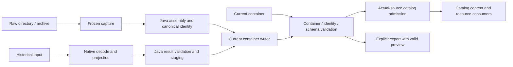

# 资产管线

> **适用问题**：原始来源转换、历史输入投影、容器读写、模型视图、preview/export 与分层验证；**不包含**：公开格式字段、Catalog 发布状态机和运行时资源缓存策略。

资产管线把来源变成可验证的当前容器，再把容器投影为领域层可以消费的模型视图。Java 拥有格式解释、canonicalizer、Protobuf 和写出；native 提供 archive、hash、压缩、图像以及历史 decoder 的有界操作。管线本身不裁决授权，也不把解析成功直接发布为客户端 Ready target。

## 组件与边界

| 组件 | 输入与职责 | 交出什么 |
|---|---|---|
| `model.catalog.ModelSourceResolver` | 根据 source kind 选择直接容器、raw 或历史导入路径 | 可重新打开的精确 identity 与 local catalog candidate 信息 |
| `DirectContainerAdmission` | 按实际来源检查 direct 成品的内嵌 preview；不改变 schema 合法性 | 可发布 direct candidate 或局部拒绝 |
| `format.vfs.VirtualFileSystem`、`NativeArchive` | 统一目录与 archive 的枚举、读取 | 原始文件视图，可能借用可复用 backing |
| `format.parser.ModelParser` | 通过实际解析路径 capture，再从冻结输入编译 | `CapturedModel` / `RawCompileResult` |
| `RawModelAssembler`、`ModelHashCanonicalizer` | 组装语义、规范化实际消费的输入记录 | Manifest、资产 payload 与 `ModelId` |
| `natives.legacy.LegacyModelImporter` | 校验 native 投影结果，写 staging 并重开验证 | 当前容器；不输出另一个长期业务运行时 |
| `AssetContainerReader`、`ModelFileIdentityReader`、`ModelFileView` | 从结构和身份逐层进入 schema | Metadata view；资源 payload 按需取得 |
| `ChunkDataSource`、`ChunkDecoding` | 读取并验证某个 descriptor 对应的 bytes | 经相应存储编码处理的 payload |
| `PreviewStore`、`ModelExporter` | 验证独立图片；复制完整容器内容并重开验证 export | 弱关联 preview cache 与原子提交的新制品 |

组件都在调用者提供的生命周期内工作。转换可以由 client 或 server 的有限工作触发；不因使用图像 codec 就要求存在客户端 `Minecraft`。GPU 纹理创建属于[渲染资源所有权](../model-management/ownership-and-lifecycle.md)。

## 正确性边界

同一次 raw 转换的身份与写出必须消费同一份冻结输入；已形成的容器不再由 raw 文件组织重新解释。语义冻结的业务含义见[模型兼容](../../concepts/model-compatibility.md)。存储编码、模型语义和渲染派生布局也必须分层：解压成功不等于 schema 有效，metadata 可读不等于所需 model chunk 全部可用，bake 成功不等于资源已发布。

转换与图像策略见[转换与导出](conversion-and-export.md)；逐层验证与 payload 所有权见[容器与分层验证](container-and-validation.md)。公开契约只查 [Asset Container](../../standards/asset-container.md)和 [Model Schema](../../standards/model-schema/README.md)，当前实现与目标标准的差异查[格式问题](../../status/known-issues/format-and-schema.md)。
