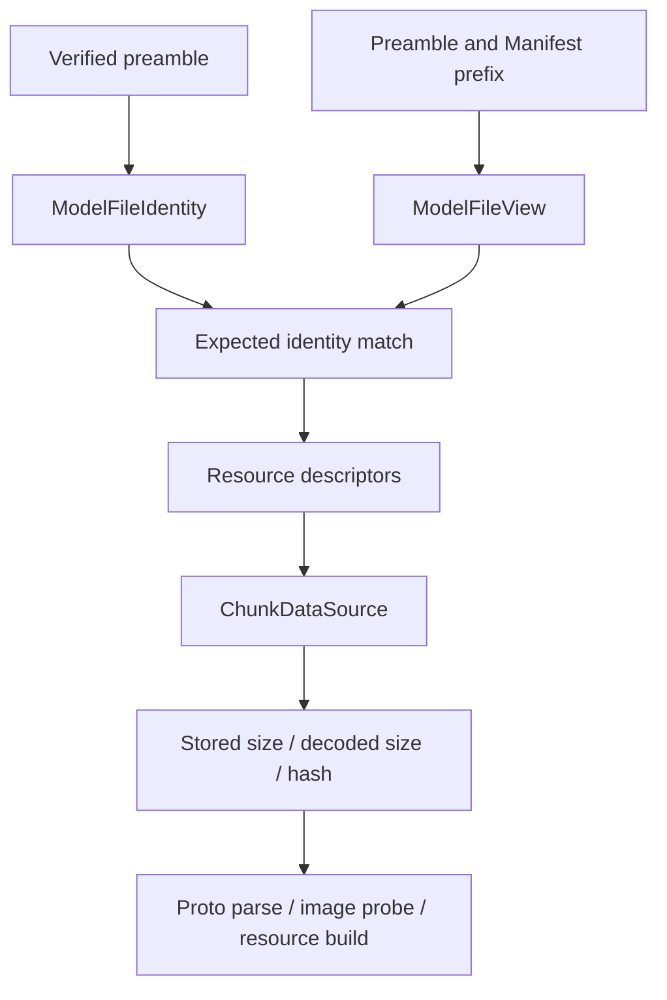

# 容器与分层验证

模型读取按容器结构、精确身份、schema 引用和实际 payload 逐层建立事实。前一层成功只提供后一层所需的输入，不替代后一层验证；尤其 local identity index 与 remote metadata 都不能提前证明 render target 已 Ready。

## 三层视图

| 层 | 定位符号 | 负责验证和保存的事实 |
|---|---|---|
| 通用容器 | `format.container.AssetContainerReader` / `AssetContainerView` | Header、版本、边界、properties、chunk table 与 verification；不解释模型、授权或动画 |
| 资产引用 | `format.schema.file.AssetFileView` | 把命名 chunk、blob 等引用映射到 descriptor；payload I/O 交给 `ChunkDataSource` |
| 模型语义 | `format.schema.model.ModelFileIdentityReader` / `ModelFileView` | Schema/version、模型身份、Manifest 与目标视图；拒绝已检查范围内的身份冲突和无效目标结构 |

`ModelFileIdentityReader` 可先从 verified preamble 建立精确 `ModelFileIdentity`，供 local index 定位候选。`ModelFileView` 再读取 Manifest，检查其 `ModelId` 与容器身份一致，并构造 `ModelInfoView`、`CommonAssetView`、`RenderTargetView`。目标、纹理与 thumbnail 的检查规则见[Manifest](../../standards/model-schema/manifest-and-identity.md)；本页只界定 reader/view 的责任。

这些 view 保留的是独立的 validation、lookup、decode 与 resource-open 边界，不是 mutable Proto 的隔离层。`ModelFileView` 保存唯一的 immutable Manifest value；`ModelInfoView` 引用其中的 `Info`、player target 与 `AssetFileView`，只为 language、author、extra-animation 等查询建立可重建索引。Target/common/asset view 同样直接引用已发布 child，并通过 `AssetFileView` 保留资源访问能力，不复制另一棵 payload。

这些实现检查不等价于整个 Model Schema profile 的一致性验收。目标规范与实现差异见[格式与 Schema 问题](../../status/known-issues/format-and-schema.md)。

## Metadata 与内容取得

`ModelFileView.readMetadata()` 按[Manifest prefix 规则](../../standards/model-schema/manifest-and-identity.md#exact-tuple-与-representation-激活)验证布局、双重身份、引用闭包与精确末端；remote activation 无需先取得全部模型。普通 chunk 仍按需读取，磁盘 commit 见[Storage](../model-management/storage-and-cache.md)。

`ChunkDecoding` 执行[Asset Container](../../standards/asset-container.md)的 stored/decoded 验证：区分 zstd 存储编码与直接 payload。zstd 路径检查 stored size，解码并核对 decoded size/hash；直接或 media-encoded payload 校验其实际 bytes 的大小与 hash，再由上层 codec 解释图像等语义。不能对解压前 bytes 使用 logical-content hash，也不能把 metadata 的有效性传播成未读取 chunk 的有效性。

## 写出与所有权

`ModelFileWriter` 组织模型 Manifest 与资产，`AssetContainerWriter` 组织通用容器。写出负责形成 bytes；验证后的 storage commit 与 catalog publication 各有独立 owner。容器格式、schema reference 和编码规则仍以[标准](../../standards/model-schema/README.md)为准。

视图负责描述，`ChunkDataSource` 负责提供 bytes，`ModelContent` / backing 负责保活。取得 owning `UniBuffer` 后由使用者关闭；借用视图不得释放 backing。访问失败与证明内容损坏必须保持区分，避免把权限、路径或 I/O 故障解释为允许删除缓存的证据，见[失败处理](../model-management/failure-and-recovery.md)。
