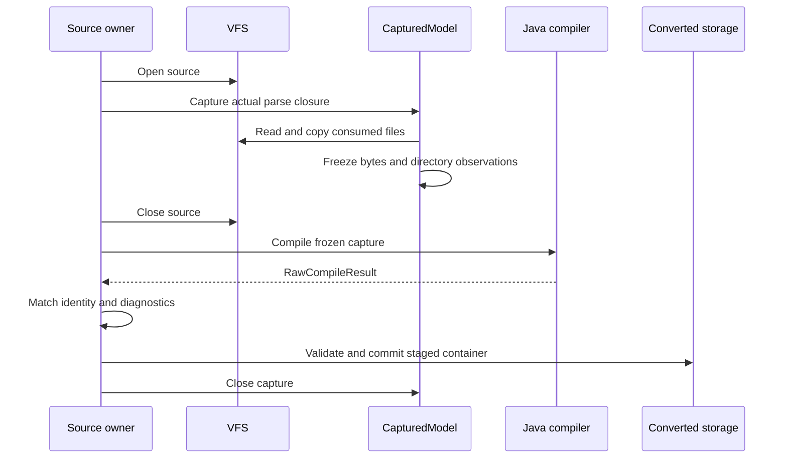

# 转换与导出

转换有一个共同出口：当前容器写出并验证后，由模型管理层接管 backing、索引和发布。来源兼容的业务边界由[模型兼容决策](../../product-decisions/decisions/model-compatibility.md)定义，本页只解释实现如何保持该边界。

## Raw capture 与编译

`ModelParser.capture()` 用 `CapturedSourceData` 包装 `VirtualFileSystem`，调用同一条 `RawModelAssembler` 解析路径发现实际输入。读取到的文件进入 owning capture，目录枚举也在 freeze 后固定；后续编译仅从 `CapturedModel.data()` 读取。`RawModelImporter.convert()` 检查编译后的模型身份与 diagnostics 均与 capture 一致。

`RawModelAssembler` 负责把几何、animation、controller、用户函数、信息与图像组成 schema payload；`ModelHashCanonicalizer` 负责身份输入记录。`DefaultAnimationFilter` 是组装时的派生处理，不建立另一条身份扫描器。Canonical records 与身份算法只在[Manifest 与身份](../../standards/model-schema/manifest-and-identity.md)定义。

Archive 的 `getFile()` 可以返回 native 复用缓存的借用视图，因此 capture 必须在下一次读取覆盖缓存前取得独立 bytes。不能把这些视图排进异步工作后继续枚举同一 archive。对应底层机制见[JNI 与内存](../native-runtime/jni-and-memory.md)。

## 图像处理的位置

图像用途由 Java 的 `RawImageCompressor.Policy` 选择，native `ImageEncoder` 执行具体编码。产品边界是[整体视觉保真、输入兼容和处理成本](../../product-decisions/decisions/image-policy.md)，不是固定编码器。

设计按表中顺序选择处理方式；zst 指 zstd 无损图片表示。

| 输入与用途 | 处理方向 |
|---|---|
| Raw 输入本来已采用有损编码 | 沿用合法可用表示，无需再次压缩 |
| 模型纹理，输入格式在 PNG/zst 之外 | 沿用合法受支持表示，无需再次无损压缩 |
| 其余模型纹理 | 以输入解码像素为基准无损处理 |
| 其余非纹理图片，低于分辨率阈值或适用受限设备策略 | 无损处理 |
| 其余非纹理图片 | 允许有损处理 |

小图和体素模型小纹理经过 YUV 4:2:0 色度采样及有损编码会明显损失色彩、边缘和透明细节，因此上述路径选择无损。小图判断尺度、阈值和具体 codec 由实现选择；不能把“能解码 JPEG”当作重新有损编码的理由。受限设备选较低成本的无损处理，仍保留 WebP/AVIF 解码。音频二次压缩是后续优化方向，不改变声音播放义务。

当前 raw 路径只对 PNG 应用用途策略；已有 JPEG、WebP、AVIF 等合法压缩表示直接复用。PNG 即使编码后的表示未缩小也采用策略输出，只有可处理的 codec I/O 失败才保留原图引用。该策略的效果与成本证据缺口见[Q-04](../../complexity-map/java-assets-and-presentation/open-questions.md#q-04)。Raw 和历史输入只在转换为当前容器前应用该策略，不隐式改写已有容器。

## 音频内容转换

Raw directory 与 archive 使用同一 parser 发现声音文件；受支持的单一 Ogg Vorbis/Opus logical stream 经结构和媒体时间轴检查后，以 direct `stream-N` 写入当前容器，并在 `Common.sounds` 中写出名称、codec、输入声道、播放采样率、裁剪后 frame 数和正整数 stream id。未知音频产生玩家可见 warning 并只省略该声音；已经识别为受支持 codec 但损坏的内容使该 source 转换失败，不能伪装为未知格式继续。

Current export 复制已验证的 stored stream bytes，不重编码音频；重开时重新核对 descriptor、chunk 存储形状、完整 bytes 与媒体解释。M1 可以只持有 descriptor，M2 materialization 必须把模型声明的全部声音解码或验证到各自完整闭包；单次播放仍只取得目标声音，不因 M2 语义在浏览阶段预读全部媒体。规范 profile 见[资产与验证](../../standards/model-schema/assets-and-validation.md#common-stringssettings-与音频)。

## 历史输入的单向投影

来源发现按完整 header 唯一路由：raw v1/v2 进入 Java raw archive adapter，带 BOM 的 v3 进入 `LegacyModelImporter.stage()`，其他 `.ysm` 明确拒绝。Java 在完成 v3 路由后把文件一次性读入有界 direct buffer；Native 的 `codec::ContainerReader` 从这个只读字节视图同步串接解密、dirty-zstd 还原、解压和 `container` 反序列化，`conversion` 再投影为公开的 C++ `ImportResult`。投影直接编码当前 `mixel.*` 消息；执行字段落在 `mixel.common.Program` 信封的 `source` 里（`ExpressionValue.program`、`InstructionKeyFrame.programs`、`AnimationReference.condition`、`Transition.condition`、`State.on_entry`/`on_exit`、`UserFunction.body`），写出的信封恒为 `format = 0` + `source`，与 Java 生产者逐字节一致；不维护第二套 legacy Proto，也不在 Java 侧做二次编译。JNI entry、descriptor 编码与 direct-buffer owner 仅位于 native library glue；legacy 模块本身不暴露 JNI。

Java 校验返回协议、Manifest 身份、payload 类型与顺序、图像元信息和音频 descriptor，然后按 payload 角色校验 `StringData`／`ModelData` 可解析（解析结果只用于校验，随后丢弃），把 blob 原样交给 `ModelFileWriter` 写出当前 staging，不重新解析或重编译其中的 `Program.source`；声音作为 direct `stream-N` 原样保存，并再次用当前媒体 profile 核对 descriptor 与 bytes。重开后复验 identity、逻辑 payload、执行字段内容、音频和存储描述，成功才交给 converted storage。识别后发生的格式、投影、校验或结果协议错误只使该 source 失败，不能回退为另一种格式。临时 native payload、response 和 staging 均由本次导入 owner 关闭或清理，历史 cache、session 和运行时管理对象不随 payload 进入新系统。

转换成功只证明当前容器内容闭包，不证明远端取得、Minecraft host adoption 或实际设备播放。历史世代、模型音频和端到端验证边界见[当前支持状态](../../status/support-and-verification.md)。

### Legacy envelope 的输入契约

在[调用方保障来源稳定](../../product-decisions/decisions/model-compatibility.md#bclegacy-source-stability-is-caller-owned)的契约下，Java 先按观察到的长度把已确认的 v3 文件完整读入 direct buffer；短读和文件访问失败在 Java 输入边缘分类，buffer 生命周期覆盖同步 JNI 调用。Native 仍独立检查源字节上限、header、summary、footer、格式 checksum 和内容预算，格式错误通过 `absl::Status` 终止。

`ContainerReader` 不拥有文件或整份明文。它直接对输入字节计算 CityHash，并按 ChaCha chunk 保留解密、去混淆和 dirty-zstd 状态；小型反序列化读取由复用的明文 look-ahead buffer 聚合，大型 image/string 目标则由 zstd 直接写入调用方范围，避免额外 bulk copy。入口不创建线程或读写全局 importer 状态；上层线程池可并行执行独立导入。

历史 decoder 读出并校验每个 `Image` 字段后立即按[图像处理的位置](#图像处理的位置)准备目标表示，不让 RGBA32 留存在完整 `LegacyModel` 中。模型纹理和 PBR 走无损用途；GUI、作者头像、icon 和预览图分别走对应的非纹理用途。RGBA32 与 PNG 都先恢复为像素再按当前平台策略编码，其中非 Android 也不会仅因历史输入已经是 PNG 就跳过策略；合法的 JPEG、WebP 和 AVIF 等既有压缩表示仍按表中的复用条件处理。`conversion` 只校验准备结果并转移压缩后的 bytes；同一历史图像被多处引用时复用首次准备结果，不恢复或长期保留原始 RGBA32。

历史声音在 native decoder 内完成单 logical stream、页序、CRC/EOS、identification packet、Opus packet duration、pre-skip、非零 granule 起点和尾裁剪检查；已支持但损坏的 Ogg 使 source 失败，只有历史 consumer 始终无法解释的 unknown bytes 才按兼容裁决静默省略。Projector 输出精确 encoding、channels、播放 sample rate 与裁剪后 frame 数；Java 仍以当前 profile 独立核对 descriptor 和原始 bytes，不把 native projector 的结构自洽当作 current admission。

## 发布与失败

`RawCompileResult` 仅表示 staging 结果，不表示 catalog 已替换。`ConvertedObjectStore` 与 `ModelSourceResolver` 负责后续对象验证及索引 candidate；准确的复用条件、source 保护和原子存储规则见[Storage 与 cache](../model-management/storage-and-cache.md)。单项 source 错误和基础设施错误的处置分别由[失败处理](../model-management/failure-and-recovery.md)定义。

## Preview 取得与显式 export

Manifest 对 thumbnail unspecified 的合法解释仍由[Model Schema](../../standards/model-schema/manifest-and-identity.md#preview-与命名图像)定义；Catalog 在 schema 验证之后另按实际来源应用准入政策。直接成品必须内嵌声明且可完整解码的 preview，raw、builtin 与 legacy 转换产生的内部容器可以缺图。来源 kind 来自实际 resolver 调用链，不能用扩展名、`origin_ver`、缓存目录或调用方布尔标记伪造；独立 preview cache 也不能把 direct 变为已准入。

日常图片取得与显式 export 先把不可变请求交给 `ClientPreviewGenerator`，由 `ClientModelService.tick()` 在 render-target owner 之后统一推进。该 runtime 同时限制 16 个 active operation、32 个尚未接纳请求和每 tick 4 次新接纳；同一 active token 从内嵌图/cache probe 起，连续覆盖 Ready/Flight 或 detached load、host、owned pixels、编码/存盘以及必要的 export 写出，直到 client tick 观察终态才释放。每个 operation 只有一个容量为 1 的阶段 fact slot；worker、target future 与 host 只能交回 owned fact，不能直接调度下一阶段或完成业务 future。内嵌图与 cache probe 在一项完整 worker task 内连续完成，remote preview probe 在 miss 时只交回 `Optional.empty()`，不会触发生成。

实际需求或显式 export 的冷 miss 才取得 target：当前 Catalog 中 exact representation 复用 `ClientModelRenderTargetManager` 的 Ready/Flight；未准入的合法 direct export 输入复用同一 loader/bake/profile，由 detached worker 交回 candidate 后再由 client tick 接纳 host 工作。Render host 在自己的执行域发布必要的 detached target，创建 256×256 私有 target，把 Ready player target 借给临时 GUI entity，完成 draw 与 readback并归还 lease/candidate；client tick 观察 owned pixels 后只接纳一次完整 worker-safe 收尾，连续执行编码、`PreviewStore.accept` 及必要的 export。Worker 不等待 host；拒绝、取消、host/编码/关闭失败与迟到资源都由同一 operation terminal 收敛。正常显示和生成不回写来源容器，也不触发 catalog identity 变化。

`/ysm export <model>` 是 permission level 2 的有限异步操作。存在 client renderer 时，common command 把整项请求交给上述 client-tick admission，不在 server callback 中先打开来源或拆出 preview continuation。无 client renderer 时，`ServerModelService.tick()` 使用独立的 server-runtime 限额（8 active、16 pending、每 tick 4 次接纳），每个 worker 连续完成来源打开、内嵌/cache probe 与可行的完整 export；缺图结果在 server tick 终态为明确失败，不让 worker 等待不存在的 host。输入可以是当前 Catalog 的已验证内容，也可以是 reloadable root 下因缺 preview 未获准入但其余内容合法的 direct container；后者不插入临时目录或第二套 catalog。Raw/builtin/legacy 复用已经转换并发布的当前容器，不重新引入长期 legacy reader。

`ModelExporter` 在私有完整输出中复制所有已验证 stored chunks，保留 `ModelId`、作者、模型行为与已有有效作者 preview/source marker；没有内嵌图时才嵌入适用独立图或本次真实生成图，并把 thumbnail source 标记为 generated。Writer 根据最终 bytes 重算 `ContainerId`，随后重开整个输出、复验 direct 准入并以 sibling temp 原子替换 `.mxc` 目标；已有 `.mxc` 路径不重复追加后缀，历史上以 `.ysm` 命名但具有当前容器 magic 的文件也按 direct source 发现。任何读取、target、host、编码、写出或复验失败都清理本次临时资源，保留来源和已有有效输出。Client service 生命周期只向 common export route 注册整项 client operation，不建立截图 RPC；无 client renderer 的进程可复用内嵌图或 cache，但 cold miss 明确失败。命令反馈回到原 server executor；操作终态后不留下长期 writer、等待 host 的 worker或补写队列。

## 统一运行制品

Raw 与 legacy v1、v2、v3 在输入边缘转换为当前容器后，统一参与读取、存储和分发。容器提供随机访问与前缀准入；维持 raw、旧容器和新容器三套长期读取入口会复制存储及验证规则，增加维护成本。转换可以直接形成内存容器，不要求为统一格式落盘。这是内部读取架构，受[作品冻结与迁移](../../product-decisions/decisions/model-compatibility.md#ddsemantic-freeze-at-export)约束。
