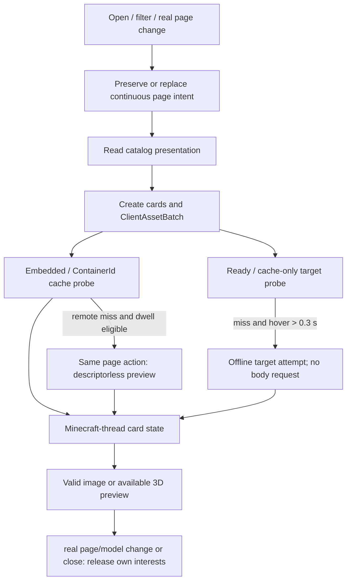

# 客户端展示

> **适用问题**：模型目录界面、模型卡预览、页面资源、选择动作与展示失败；**不包含**：服务端授权规则、网络分片协议和共享模型资源的物理回收算法。

界面消费 model service 的目录投影，为当前页面建立资源需求；metadata、图片和 3D target 表达不同完成程度，展示不构成授权，产品边界见[model-authorization](../../product-decisions/decisions/model-authorization.md)。

## 页面与资源 owner

| Owner | 持有的状态 | 与领域层的交接 |
|---|---|---|
| `client.gui.PlayerModelScreen` | 搜索、分类、pack、页码、当前按钮与 `pageAssets` | 读取 `ClientModelService.catalog()`；只在真实页面需求改变或关闭时释放旧需求 |
| `CatalogDemandTracker` | 当前页面身份、连续起点、前页持续时间和待发送效果 | 目录内部重建交接同一意图；严格执行 0.7 秒缺件门槛 |
| `CatalogBrowserState` | 当前目录的展示过滤与层级投影 | 保留目录事实来源，不建立可修改的 content authority |
| `CatalogModelCardState` | 单卡 preview、hover 起点、cache-only target 与 GUI entity | 先用图片/Ready；连续 hover 超过 0.3 秒才尝试离线 target，通过 `ResourceLease` 保活结果 |
| `client.model.ClientAssetBatch` | 当前页面的 preview、pack cover、presentation 需求集合 | 显式 `submit()`，由 asset repository 选择对应分发与完成路径 |
| `client.texture.CustomTextureManager` | Standalone GUI texture 的需求与注册 | 与 loaded model texture 的构造和 cleanup owner 分开，见[资源所有权](../model-management/ownership-and-lifecycle.md) |

## 页面主流程

Catalog snapshot 替换后由 `tick()` 触发页面重建；如果实际页面与模型需求未变，`CatalogDemandTracker` 交接原连续起点而不先撤再建。真实翻页、过滤/排序导致的展示集合变化、移开、模型身份变化或关闭才替换需求。异步 cache miss 只更新缺件事实，不重写起点；迟到完成仍由原卡片/页面 owner 接纳或释放，不能复活已关闭页面。

页面 batch 的完成与 remote/preview cache 的提交不是同一个事务。`ClientAssetRepository` 把图片需求交给 client runtime；client tick 接纳后由一项 worker 连续探测内嵌图和独立 cache，completion 只交回 fact。Remote preview miss 仍加入同一 page action、child 与 dispatch 生命周期，不建立 eager 第二请求。接收端由唯一 final range 动态确定 preview 大小，完成媒体解码后可先提交独立 cache；后续 sibling 失败不回滚已验证 cache。Fetcher 同步异常、空 future 或异步失败都使尚未关闭 batch 终态，不能永久悬挂。页面关闭仍由原 owner 撤销 exact page action 并处理取消，不扩大为共享 cache 的清理权。

模型卡先查询 Ready 或 `getOrStartCached()`；只有连续 hover 同一模型严格超过 0.3 秒后才调用 `getOrStartOffline()`。其 exact cache-only 边界由[Storage 与 cache](../model-management/storage-and-cache.md)定义。展示图由内嵌/独立 cache/特化 presentation 路径取得，不能把 preview 下载误算成 model body 已 Ready，也不能把离线 miss 固化成以后正常加载的失败。Local cold miss 与显式 export 可在统一 client-tick admission 下复用真实 player target，进入 256×256 私有 framebuffer 的 draw/readback 和 worker 编码；该路径不是空白占位图，具体边界见[转换与导出](../asset-pipeline/conversion-and-export.md#preview-取得与显式-export)。GUI entity 复用动画与 render-target 机制，hover/focus 只是其展示输入，见[实体与帧状态](../animation/entity-and-frame-state.md)。

## 选择与显示的分离

`PlayerModelScreen.selectModel()` 在 Local 模式更新本地 capability，在 Active session 通过 `ClientProtocolGateway.selectModel()` 发出请求；已有 Roaming storage 时还存在本地 capability 更新路径。服务端最终裁决与后续 PlayerState 顺序由[玩家状态与控制](../network/player-state.md)定义。

Selection 和运行资源请求分别持有自己的连续需求状态。当前缺件且前项持续不超过 0.7 秒时，新项必须连续停留严格超过 0.7 秒才发出相应效果；首次无前项、前项已持续更久和已有有效内容立即推进。Local player 与每个 remote entity 各自计时，不能互相阻塞；selection 的发送终态也不成为资源请求计时的门禁。

模型卡错误、导入 diagnostics、animation failure 与 session failure 分属不同范围，传播规则见[失败处理](../model-management/failure-and-recovery.md)。

预览与模型选择的产品语义见[创作与选择需求](../../product-decisions/requirements/req-create-and-select-models.md)，本页不重新定义选择、权限或下载策略。
