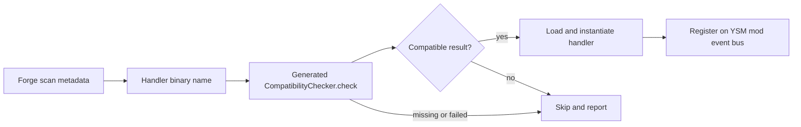

# 游戏与扩展接入

> **适用问题**：Forge 生命周期接入、entity capability、渲染 hook、兼容适配与扩展装载；**不包含**：第三方模组内部机制、通用公共 API 承诺和游戏业务规则的重新定义。

接入层把 Minecraft/Forge 的实体、事件与绘制上下文交给 YSM 已有 owner。Common、client-only、per-entity 并行求值与 render-thread hook 是不同边界；新增接入点时不能只凭它们都使用 event bus 就假定相同调用线程或状态权限。

## 游戏侧接入

| 窗口 | 定位符号 | 交接对象 |
|---|---|---|
| Common / client setup | `event.CommonEvent`、`client.event.ClientSetupEvent` | 基础设施、网络注册、client 兼容适配和服务；顺序见[运行模型](../runtime-model.md) |
| Entity capability | `event.CapabilityEvent`、`ModelInfoCapability`、各类 `AnimatableCapability` | 将模型选择/同步事实与客户端动画对象关联到 entity；服务端不运行客户端骨骼求值 |
| 登录与退出 | `ClientLoggedEvent`、`ServerStartingEvent` | 将 exact connection 或 server lifecycle 交给对应 session/service owner |
| 客户端输入与命令 | `client.input`、`client.command`、`command` | 产生选择、动画或管理意图，继续经过所属领域入口 |
| Entity 替换绘制 | `GeoReplacedEntityRenderer`、`client.renderer` | 消费已准备的 `GeoRenderData`，选择 render state 并交给 renderer |
| 可选模组适配 | `client.compat` 与 controller collection | 把外部动作、装备、视角和材质条件投影为当前输入或绘制行为 |

模型替换的业务范围与可选联动降级由[联动决策](../../product-decisions/decisions/mod-integration.md)和[联动风险](../../product-decisions/decisions/integration-risk.md)定义。现有兼容分支不是统一输入层；其未收敛的部分见[动画问题](../../status/known-issues/animation.md)。

## 已有事件表面

`api.model.v0` 与 `api.rendering.v0` 中的 YSM 事件使用 mod event bus。`RegisterModelLocatorEvent` 把特定 `ModelKind` 的 locator 注册函数交给订阅方，注册窗口由对应 locator owner 建立；它不把整份骨骼模型的修改权交给扩展。

在 `GeoReplacedEntityRenderer` 的玩家主路径，`RenderModelEvent` 位于有效 `ModelState` 的模型提交前；取消只跳过该处默认模型 render。`RenderLayerEvent` 则包围默认 layer 遍历。两者按各自触发窗口使用，不能把取消其中一个解释为回滚已完成的动画、资源取得或所有 Minecraft 绘制。它们携带的 `PoseStack`、buffer 和 `GeoRenderData` 属于本次 draw，不供异步长期持有。

`RegisterRenderStateModifierEvent` / `RenderStateModifier.apply()` 还不能作为已接通入口使用，具体接线缺口见[渲染问题](../../status/known-issues/rendering.md#扩展接线)。规划中的公共适配能力仍由[联动方向](../../future/mod-animation-integration.md)承载；已有声明不构成稳定公共 API 承诺。

## 扩展兼容检查与注册

`@YsmExtension` 为类或方法声明兼容检查入口，`@YsmEventHandler` 为可自动发现的 handler 声明同类检查要求。`YsmExtensionProcessor` 在编译期间分析扩展所拥有的类及依赖，并生成 checker；运行时 `YsmEventHandlerLoader` 在 `FMLLoadCompleteEvent` 从 Forge scan metadata 发现 handler 名称，去重排序后逐个处理。

`YsmEventHandlerRegistration.prepare()` 先加载并执行 checker，兼容结果成立后才实例化 handler。缺失 checker、检查失败、类加载或注册异常按 handler 隔离；有 warnings 的兼容结果可以注册并记录诊断。该检查处理链接与声明覆盖，不验证第三方业务语义、并发正确性或游戏视觉效果。

Forge scan data 的产生与 FML 内部装载属于外部 loader 边界。YSM 这里只定义拿到 metadata 后的处理；不能据此推断其他模组 handler 的完整初始化顺序。扩展最终仍要满足所接入 owner 的线程、生命周期和取消边界。
