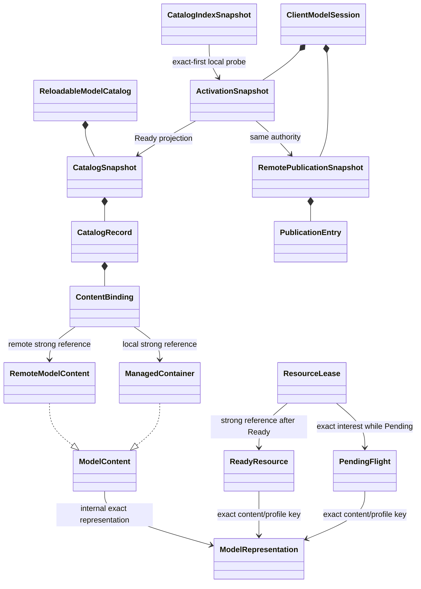

# 模型管理架构

> **适用问题**：模型来源、目录与激活发布、资源取得、cache、lease 和失败隔离；**不包含**：容器字段、网络 frame 与动画或顶点算法。

进程级 local catalog 持有跨游戏存续的已验证内容；client 与 game server 各自持有 session 投影和 runtime resource owner。连接到支持 YSM 的 server 后，client 先原子切换到 lean `RemotePublicationSnapshot` authority，再以 `ActivationSnapshot` 隔离每个 entry 的 Pending、Ready 与 Failed；`CatalogSnapshot` 始终只包含完整 Ready content。Resource 只通过内部 binding view 取得精确 `ModelContent`，使用资格仍来自当前 exact session。

`ModelId` 是跨模块模型身份；精确容器表示封装在模型管理与网络内部，具体对象关系见[Catalog 与来源](catalog-and-sources.md)。

- `ModelSystem` 提供 builtin contract、intrinsic default 与 local storage；[默认模型](default-model.md)先在 private candidate 完成验证，再发布 client service。
- Catalog owner、client render owner 与 server game owner 各自单写所属 mutable facts；[Reload 与发布](reload-and-publication.md)把 worker 的逐项完成事实按 tick 合入唯一 current snapshot。
- `ClientModelSession` 管理 Local、Negotiating、Active、Default Only、Closed 五态；remote publication、activation 与独立 selection 的交接见[Catalog 同步](../network/catalog-sync.md)。
- Resource 按精确内容、render key 与 runtime profile 复用工作；[所有权与生命周期](ownership-and-lifecycle.md)定义 Pending Flight、Ready lease、30/60 unused LRU、纹理门禁与 exact-session 退出。
- 页面和每个玩家实体只提交当前连续意图；[客户端展示](../client-presentation/README.md)定义 preview、hover 与 dwell，独立图片和 export 见[转换与导出](../asset-pipeline/conversion-and-export.md)。

磁盘与派生物见[Storage 与 cache](storage-and-cache.md)，失败范围见[失败处理](failure-and-recovery.md)，工程取舍见[模型管理决策理由](design-rationale.md)。

按 game server 与 client 区分的事件级加载、按需取得和释放行为见[资源加载与释放矩阵](resource-loading-matrix.md)。

[Mock 验证架构](verification.md)说明领域测试、物理 classpath 双端、Forge 薄适配器与证据汇总的边界；这些验证设施不参与生产 authority 或资源 ownership。

## 定位与交接

`com.elfmcys.ysm.model` 承载领域状态，`com.elfmcys.ysm.client.model` 承载客户端资源与展示投影。对同一个 `ModelId`，先明确查询的是 authority、Ready content 还是 consumer target，再进入相应 owner。

| 问题 | 符号入口 |
|---|---|
| 来源发现与身份候选 | `ModelSourceDiscovery`、`ModelSourceResolver`、`CatalogIndexSnapshot` |
| Local reload 的 candidate 与提交 | `ReloadableModelCatalog`、`CatalogReconciler` |
| Remote authority 与激活 | `ClientModelSession`、`RemoteCatalogActivation`、`ActivationSnapshot` |
| 当前客户端内容与 resource request | `ClientModelService`、`ClientCatalogManager`、`ClientModelRenderTargetManager` |
| Pending 合并与 Ready 保活 | `ModelRenderTargetCache`、`ResourceLease`、`EntityModelBinding` |
| Server 侧 session 与资源服务 | `ServerModelService`、`ServerModelSession` |

新来源的实际转换见[资产管线](../asset-pipeline/README.md)，页面消费者见[客户端展示](../client-presentation/README.md)，JNI 对象如何承接所有权见[JNI 与内存](../native-runtime/jni-and-memory.md)。这些入口不增加第二个 model current-content owner。
