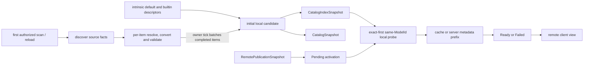

# Catalog 与来源

进程级 Local Catalog 的不可变 current candidate 同时包含 `CatalogIndexSnapshot` 与 `CatalogSnapshot`：前者保存可重新打开的完整文件 identity 与来源证明，后者只保存已经完整验证并 materialize 的 Ready content。Client 与 game server 分别消费该内容事实，但各自 session、授权和 runtime resource 状态不进入 Catalog。

Local 来源保护见 [DD.user-model-sources-are-readonly](../../product-decisions/decisions/artifact-storage.md#dduser-model-sources-are-readonly)。以下省略或替换针对内存中的 candidate/snapshot；local 合成规则如下：

- Startup 只物化 intrinsic default 和 builtin descriptors；普通 builtin、custom 与 auth source 在首次消费者完成 converted 登记并启动扫描后，才逐项识别、转换和验证。
- 同一路径的 auth 候选优先于 custom；用户来源不得占用 builtin 保留身份或路径。
- 同一路径或同一 `ModelId` 的多个候选由本次扫描中首个完整验证并被 owner 接纳的候选占用；worker 完成顺序可以使冲突赢家不确定。Publication activation 仍将 exact container 候选放在同模型非精确候选之前。内容损坏继续下一个候选，普通访问错误保留其 provenance。
- 单模型 parse、conversion 或 validation 失败只省略该项；完成项按每 tick 处置预算批量合成新的完整 candidate 并发布。根目录无法完整发现时，已发布的有效新项保留，但本次不得据该根的缺失观察删除旧项。
- `CatalogSnapshot.byModelId` 是唯一 current-content map；location index 由同一获选表完整派生，`CatalogModelLocation` 只作来源/path 索引。Map、packs 和 report 每次作为一致不可变值替换，不包含 nullable 或 fake content。
- Catalog publication 还应用来源政策：真实 direct container 必须声明并完整解码有效内嵌 preview；raw、builtin 和 legacy 的内部转换容器可以合法缺图。该门禁不改变 Model Schema 对 unspecified 的合法解释，独立 preview cache 也不能补足 direct 准入。

Local/remote 投影切换由[Reload 与发布](reload-and-publication.md)定义。连接期间 Local Catalog 继续扫描并持有完整内容；disconnect 只撤 remote session 投影并立即恢复最新 local snapshot，不重建或 restore materialization。

Remote view 不与 local snapshot 合并。`RemotePublicationSnapshot` 只表达 server authority；每个 `PublicationEntry` 依次尝试 active exact、local exact、active local same-`ModelId`、当前 local index 的其余 same-`ModelId` 候选、remote exact cache、server metadata prefix。只有经 local 来源证明的内容允许 `ContainerId` 不同；remote cache 与 server 内容始终 exact。只有 Ready entry 进入 `CatalogSnapshot` 与 `ClientCatalogEntry`；Failed entry 只保留 publication path、access 和错误，Pending 不构造 content projection。

Ready representation 的 `ModelFileView` 是解析后 Manifest 的唯一事实。`CatalogModelMetadata` 只增加 catalog path、identity 与 representation 上下文，并直接引用该 view 的 `ModelInfoView`；同一 representation 构造的 `ModelRenderTarget` 共享这份 `ModelInfoView`。Catalog、`CommonAssetData` 与 `CommonAsset` 不再各自复制 Manifest metadata 或 language tree；后两者只保留渲染/动画执行所需的派生资源。

## 身份与 representation 对象

Java 的 `modelId` 与 `containerId` 都使用 `Hash256`，由唯一共享值 `ModelFileIdentity` 成对携带；`ContainerId` 是字段角色，不另建 nominal type 或 pair adapter。产品身份含义见[模型身份](../../product-decisions/decisions/model-identity.md)。`ContainerId` 及携带它的 tuple 仅限模型管理与网络（含内部存储和私有派生 cache），不得进入动画、渲染、entity、resource、lease 或公开 cache interface；改名为普通 hash 也不能绕过边界。其他消费者取得资源或 opaque 派生缓存键。

`CatalogIndexSnapshot` 可保存完整 identity、catalog location、实际来源 kind 与可重新打开的 backing reference；按 `ModelId` 提供候选，exact identity 优先。它不因独立图片存在而证明 catalog 准入或完整 content 可用；每个读取仍须沿对应 source instance 完成适用验证。

Local `ManagedContainer` 与 remote content 都投影 `ModelRepresentation` 和 `ChunkDataSource`。Representation 保存实际 `ModelFileIdentity`、已解析的 `ModelFileView` 及可选 `UniBuffer` metadata prefix；publication 独立保留 server identity、path 与 access，本地非精确复用不改写任一方。Direct container 保留只读原件位置而不建立稳定副本；runtime 接纳时建立精确读取实例，后续访问故障或内容校验失败只单向标记该实例，已开始且验证成功的读取和已经完成的资源仍独立有效。File-backed 与 remote representation 必须持有 prefix，只有 intrinsic default 完成驻留且原 backing 不再存在后可以释放。调用方取得 prefix 的只读拥有引用并负责关闭；不并存可变 Manifest byte array。字节验证见[容器与分层验证](../asset-pipeline/container-and-validation.md)。

`ContentBinding` 强引用、旧 content 保活和 Catalog-held 引用撤销见[所有权与生命周期](ownership-and-lifecycle.md)。

网络 publication、activation 与 selection 详见[Catalog 同步](../network/catalog-sync.md)，reload ordering 详见[Reload 与发布](reload-and-publication.md)。
