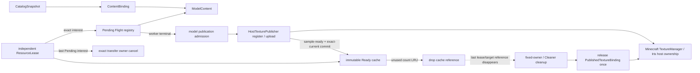

# 所有权与生命周期

共享 render target 由 Ready cache 与 consumer lease 的强引用保活。`ResourceLease.close()` 只撤销 consumer interest/reference；`cancelPending()` 只在该 lease 仍绑定 exact Pending Flight 时撤销其 interest。两者都不拥有 render target 或 shared texture 的物理关闭权。显式物理 close 只用于 ownership 固定、terminal point 可证明的资源和构造失败回滚，cleanup 路径必须汇合到同一个 exactly-once action。

- `ContentBinding` 强持有 `ModelContent`，两者都不提供 `close()` 或实现 `AutoCloseable`；snapshot 替换只撤销 Catalog-held 引用，旧 content 由 Resource 或 lease 继续保活。
- 文件型 content 的延迟读取不能仅靠强引用保护用户可修改的原件。Direct container 不建立稳定副本；runtime 为每次接纳建立[精确读取实例](storage-and-cache.md#direct-container-的精确读取实例)，原件变化可以使未来读取局部失败，已经完整验证的 target/bytes 继续由自身引用保活。
- 精确内容、render key 与 runtime profile 形成 stable resource key；Java `ModelContent` 对象 identity 和 builtin/local/remote 展示来源不参与等价判断。Ready cache 与 Pending registry 是不相交的内部状态，每次 acquire 都返回独立 `ResourceLease`。Consumer 若保存裸 target，必须同时强持有产生它的 lease。
- Intrinsic default 由 required lease owner 显式持有，不由来源标志、pin 或 preload set 隐式承担。普通 Ready entry 保存 cache reference 与有效 consumer 数：最后一个 consumer 退出后进入 unused LRU，再取得时离开 unused；PC 最多保留 60 个、移动端 30 个无消费者完整 target，超限只撤最旧 cache reference。活跃 target 不计入该数量，同一共享 target 不按 lease 数重复计数，也不按 idle 时间驱逐。
- Required intrinsic default 的 finalization 不经过通用 resource publication callback。Private service candidate 将唯一 candidate ownership 直接交给 `ClientModelRenderTargetManager`；manager 要么在 service publish 前采用并持有 default target，要么在构造失败路径 exactly-once 关闭它。Service publish 之后不再存在可回滚的 partial default authority。
- Pending acquire 加入当前 exact Flight 或建立新 Flight，并把 interest 绑定到 exact consumer owner。最后一份 interest 消失时先移除该 Flight 的命中资格；在 pre-admission 消失时不产生 transport commitment；admission 后消失则只请求取消该 Flight 对应的 exact transfer lease。
- Flight terminal 先通过 object identity 移除自己的 Pending entry，再公开 Ready、failure 或 cancellation。Failed/cancelled Flight 不能被后续 acquire 命中；replacement 建立新 Flight 后，迟到旧 terminal 不能移除或覆盖它，terminal transfer 也不能被随后发生的 interest release 追溯取消。Deterministic stage diagnostics 可由 exact domain 展示或快速拒绝，但不能保留旧 Flight、interest、transfer lease 或 completion authority。
- 成功 worker terminal 仍是 pre-Ready candidate。native/animation resource 必须已完整通过。Model publication owner 按 PC 4 / mobile 2 的 ordinary **terminal disposition** 预算在 render owner 上调用无状态 `HostTexturePublisher`，完成 selected base 与所有 present PBR component 的 registration/upload 和 host adoption 校验，再以 exact-current 结果提交唯一 Ready entry。Stale、失败和成功都消耗处置预算；任一 component 或 host step 失败只拒绝 candidate，旧 Ready 或 intrinsic fallback 的 target、sampled mapping 和 requested texture intent 均保持不变。
- Catalog 替换立即影响 `isCurrent`，但不强制关闭仍可达的旧 lease或合法 cache entry。新 ready lease 先安装，再撤销旧 consumer lease 强引用。
- Exact connection/session transfer owner 持有 accepted transfer lease、assembly 与 cancellation emission；resource consumer 和 model worker 只能请求取消，不能关闭 lease。Catalog replacement 与 disconnect 会使匹配的 Pending Flight 失去本次资格；已完成且不携带 fetcher/query/session capability 的同内容/profile Ready 可以继续保留。Local `ManagedContainer` 由 catalog、lease 与 resource reachability 收敛。
- `ModelRenderTarget` 清理 ownership 固定的 native/animation resources，并对 adopted `PublishedTextureBinding` 发出一次 logical release。`HostTexturePublisher` 只实现无状态 publication seam；Minecraft `TextureManager` 以及已采用 PBR children 的 Iris host 才拥有 mapping removal、texture close 与 GPU id release。Registration 和 sample-ready upload 必须先于 Ready commit，target retirement 后的物理 cleanup 可以自然滞后，但不能回滚 model authority。
- `CustomTextureManager` 只拥有 preview、avatar、pack icon 等 standalone GUI texture 的同步 load/reload、demand 与 release；它不能保存 model candidate、prepared bundle、admission 或 model terminal state，也不是 model texture 的物理 cleanup owner。
- 独立 preview 的 encoded bytes 由 `PreviewStore` 词法拥有读写；页面 texture、accepted network source 和 export operation 各自持有副本或显式 lease。Client tick 以一个 bounded operation token 连续持有 probe、target/detached candidate、host pixels 与 encode/persist/export 的 obligation；跨域阶段只有容量为 1 的 owned fact slot，终态由 tick 观察后释放。Dedicated server 的无 host export 同理由 server tick 接纳并终结。图片 cache 不获得模型 target、来源容器或 host texture 的关闭权，页面关闭也不能删除已验证 cache。
- Exact connection 退出只 seal 该 session 的 admission、取消本次 transfer/assembly 并丢弃迟到效果；它不关闭进程 Catalog、shared runtime worker、合法 Ready、registered image 或 chunk cache。进程关闭时，各长期 owner 才停止自己的 producer/executor并处置仍归自己所有的结果；host Netty、另一 physical side 和 GC/Cleaner reclamation 都不是 session 关闭条件。
- `ManagedContainer`、owning `UniBuffer`、native object、texture holder 和 baked target 通过 Cleaner 保底。Thread-affine GPU 销毁由 cleanup action 排入 render thread。
- Minecraft `NativeImage`、profiler scope，以及临时 `NativeBuffer`、source capture、staging 与构造失败半成品由唯一词法 owner 确定性关闭；borrowed view 不注册 cleanup，也不释放 backing。
- Immutable Proto 的 Java value 共享见[运行模型](../runtime-model.md#不可变-proto-发布边界)；buffer token、borrowed view、opaque handle 与 JNI fence 见[JNI 与内存](../native-runtime/jni-and-memory.md)。

Cleaner 不承诺回收时限，HotSpot 也不会按 mimalloc/多数 GPU allocation 的真实大小主动增加 GC 压力。因此仍可达的 Ready target 或其他 shared native/GPU 资源，其物理回收延迟没有时间和容量上界；逻辑 retirement、lease release 或 session close 都不承诺立即物理回收。这是本设计为消除跨 owner 手动销毁竞态而接受的取舍。及时停止下载、释放文件/锁或结束 profiler scope 仍必须使用各自的显式取消/关闭协议，Cleaner 不能成为这些正确性门禁。

## 模型音频生命周期

`ClientAudioRuntime` 是客户端 encoded/PCM 保留事实的唯一 authority；`SoundSource` 只描述内容，render target 不拥有第二份声音 cache。每次 `createPlayback` 建立独立取得取消资格、decoder/PCM cursor、loop 状态和短 PCM 候选，共享的只有不可变 encoded 或完整 PCM。Stop、失败、disconnect 与 runtime close 先使本次迟到取得、下一段读取、下一周期 loop 和未完成候选失去资格，再关闭本播放独占的 stream/decoder；其他播放和已经合法发布的 Ready 数据不被追溯销毁。

宿主交接由局部 handoff ticket 闭合。Provider future 完成只产生一个 offered stream；`Channel.attachBufferStream` 实际采用时才把消费责任交给 Minecraft channel。`ChannelHandle.release` 先记录 host 已释放，再允许 callback；即使宿主跳过 execute callback，未采用 stream 仍由 ticket 终结。采用后 Minecraft 推进和关闭 `AudioStream`，YSM stop 仍撤销自己的候选与后续效果，但不等待设备已排队声波消失。

短 PCM 发布只撤销 runtime 对旧 encoded 的缓存引用。已经持有该 backing 的播放继续有效，最后 owning reference 退出后由 `UniBuffer`/Cleaner 完成物理回收；没有强制 GC 或固定回收期限。Accepted transfer、文件句柄、native decoder 和未采用 stream 仍由各自 exact owner 显式终结，不能用 Cleaner 代替。
