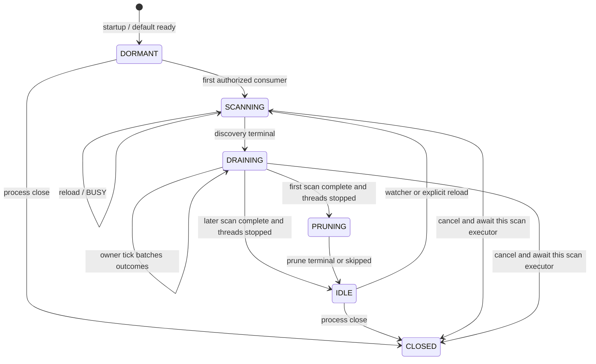

# Reload 与发布

进程级 `ReloadableModelCatalog` 是 local content 的唯一 writer。构造只安装 intrinsic default 与 builtin 描述，不扫描普通目录、不访问 shared converted；client join 或 server start 在取得 converted 消费资格后调用 `startScanning()`。后续 watcher 和显式 reload 只请求同一入口；同一时刻最多一个 active scan，重入返回 `BUSY`。

Catalog、client runtime 与 server runtime 各有独立有限执行容量。每个 worker task 接受冻结输入并连续执行一条 worker-safe、有限、不会等待 owner thread、其他 worker、网络或 host callback 的处理链。跨 owner queue 只运输 immutable terminal fact；长期业务状态由对应 owner 的 tick 提交。Host publication 已完成后可以产生新的独立工作，但原 worker 必须已经终态。

## 增量 scan

一个 active scan 拥有本次发现事实、逐项 outcome、获选冲突表、首次保留集合和专属 executor：

- 发现阶段只建立实际来源观察；raw/legacy 的解析、转换、完整验证与 direct 的完整验证都在各自的一条有限 worker chain 中结束。
- Owner 在接纳完整 outcome 时为路径和 `ModelId` 冲突确定本次赢家。完成顺序可能不同，因此冲突来源不承诺固定赢家；目录、location index 与 pack 投影始终从同一获选表构造。
- 每个 tick 在处置预算内合成一次新的完整 `CatalogIndexSnapshot` / `CatalogSnapshot` 并发布。坏新项不替换旧有效项；已经发布的新项不因同次 scan 的其他失败回滚。
- 只有完整根观察能够确认删除。根不完整或 inventory 无法闭合时保留该根的旧项，同时保留已经发布的成功项与诊断。
- Scan completion 要求发现和全部结果已处置、没有未来 producer，并且专属 executor 物理终结；owner tick 不等待线程或磁盘 I/O。

首次 scan 记录本次 builtin、候选及曾发布/使用的 converted 对象。全部结果处置且 executor 终结后，Catalog 只接纳一次完整 prune 工作；清理许可、跨进程消费者与删除集合见[Storage 与 cache](storage-and-cache.md#converted-storage)。Prune 终态或跳过后释放该保留集合，不建立长期引用图。

Local snapshot 的 observer 在 authority commit 后逐个通知；一个 observer 失败不能回滚 current 或阻止其他 observer。Catalog close 只在进程级关闭时停止 watcher、取消并等待自己的 active scan executor，再撤 current 引用；游戏退出或断开连接不会关闭进程 Catalog。

## Local 与 remote 投影

`ClientCatalogManager` 始终订阅进程 Catalog 并保存最新完整 local index/snapshot。进入 remote session 时，公开 client view 先切到 intrinsic default，再由当前 `RemotePublicationSnapshot` 和 entry activation 形成 session projection；Local Catalog 继续扫描、发布和持有完整内容，不进入 index-only 模式。

Disconnect 先使 exact connection 的 admission、request 和迟到效果失效，再撤销 remote projection 并直接发布最新 local snapshot。该过程不 materialize、restore 或等待共享 worker，也不清空已完成 resource cache。新的 connection 只建立自己的查询表和请求资格；同内容/profile 的合法已完成资源可以继续复用。

## Runtime 与 host publication

Runtime 在网络输入已 terminal 或本地输入已齐全后，才接纳完整 cache/read/load/bake 工作。磁盘 cache 成功可以在后续 host failure 前独立保留；worker terminal 仍只是 pre-Ready candidate。Render owner 完成 texture registration/upload 与 host adoption 后，把不可变完成事实投回 runtime queue；runtime tick 在普通结果处置预算内决定 Ready、失败或取消。完整门禁与 lease 见[所有权与生命周期](ownership-and-lifecycle.md)。

Client tick 提交进程 Catalog、client runtime 和同 JVM server runtime 的事实；integrated server session 的授权与请求仍由 server tick 单写。Dedicated server 由 server tick 提交 Catalog、server runtime 与 session。盘 I/O、转换、原子文件提交和 prune 都留在有限 worker；tick 只合并已经完成的事实。

## Server publication

每个 `ServerModelSession` 完整验证 candidate 后，先原子切换自己的 current snapshot、private container lookup、grants 和独立 selection facts，再从已提交 collection 构造 typed full/delta 并 best-effort 交给 global dispatch worker。Collection packet 不包含 selection；后者继续由 ID 17 player-state owner 独立同步。编码或 enqueue 失败不回滚 server authority；后续 delta 以当时的 server current snapshot 为 previous。

Commit 只替换 owner 自己持有的 binding graph。旧 content、Ready lease、accepted transfer 和物理 host resource 的继续有效及关闭责任分别由[所有权与生命周期](ownership-and-lifecycle.md)和[资产传输](../network/asset-transfer.md)定义。
