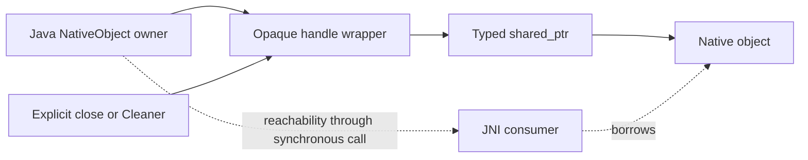

# JNI 与内存

跨语言值主要有两类：调用期间借用的 bytes，以及需要显式保活的 native 对象。Java wrapper、NIO view 和 native backing 的生命周期必须分别辨认；raw address 和 `jlong` 自身都不提供所有权证明。领域层的唯一关闭责任与 Cleaner 规则见[所有权与生命周期](../model-management/ownership-and-lifecycle.md)。

## Buffer 传递

`buffer.UniBuffer` 统一 array 与 native memory 的访问。`natives.buffer.BufferArgument.packInput()` 把底层对象、类型、offset 和 size 编成 JNI 输入，`ysm::java::BufferInput` 在 native 入口还原范围并验证容量。该描述符只是本次调用的内存视图，不是持久资源 handle。

| 形式 | 实现机制 | 使用边界 |
|---|---|---|
| Array input | `BufferInput` 默认使用 critical array；safe 变体复制到 native cache | Critical 区间必须限定在对应同步操作内，不得把所得地址保存给延迟工作 |
| Direct input | `GetDirectBuffer()` 校验 offset/size 并取得地址 | 不复制 backing；原 owner 必须持续可达，不能把 NIO view 存活等同于 owner 存活 |
| Owning output | `BufferOutput` / `TryMoveToOutput` 输出 array 或转移 native allocation | Direct output 由 `BufferArgument.unpackOutput()` 接成 `NativeHeapBuffer`，与分配方式配对释放 |
| Archive file view | `NativeArchive.getFile()` 借用 archive wrapper 的缓存 | 下次 extract 可覆盖缓存；跨读取或异步保留需复制，详见[转换 capture](../asset-pipeline/conversion-and-export.md) |

`slice()` 不增添独立 ownership token，`acquire()` 取得独立引用，`copy()` 复制 bytes；它们不能互换。`Image.probe()` 保存输入的 acquired reference，`Image.share()` 再取得一份独立引用；像素解码输出与压缩图像 backing 是不同对象。Slice 与原 view 共享 token；显式 close 与 Cleaner 汇合到同一个 exactly-once action。Borrowed view 不注册 cleanup，也没有释放 backing 的权利。

## Protobuf bytes seam

Java 内部可以共享 immutable generated message，但 JNI 边界不暴露 QuickBuffers 类型。Bake/read 等调用先把 message 序列化到由 Java 明确拥有的 protobuf bytes，再按上节的 buffer 契约在同步调用期借给 native；generated `Builder`、parse cursor 与 allocator 都不是 ABI。Malformed bytes、native `tryBake == false` 与 Java wrapper/handle 失败分别保留各自结果语义，不能用 partial message 或裸 pointer 绕过。

序列化临时 buffer 的 owner 必须活到 JNI 返回，返回的 opaque handle 或 owning output 再按各自协议保活和关闭。Immutable message 的默认 bytes copy 只保证 Java value 不受原 input cursor/backing 后续变化影响，不替代这里的 `UniBuffer`、texture pixels 和 native handle 生命周期。

## Opaque handle

普通 native 对象 handle 使用 `MakeOpaquePtr` / `ShareOpaquePtr` 创建的类型化 shared ownership。`CastOpaquePtr<T>` 能检查空值与类型，但不能验证一个任意非空地址是否已被销毁；Java `NativeObject.get()` 因而必须先拒绝已关闭对象。

并非所有 `jlong` 都采用这套表示：archive adapter 有自己的 proxy 和 destroy，legacy result 也有独立 payload 所有权。只能调用对应类型的释放入口，不能把它们统一交给通用 opaque destroy。

Opus decoder handle 同样使用专属协议：每次播放独占创建，Java 以 direct input 分段 `feed`，输入耗尽后只调用一次 `endInput`，再用 direct destination `read` 到精确 EOF 或错误。Handle 不进入 pool，也不跨播放共享 cursor；显式 `close` 与 Cleaner 汇合到同一原子 destroy。每次 JNI 调用都 fence decoder owner 和对应 direct buffer，防止调用期间 backing 被回收，但 fence 不允许并发 close/use。

JNI/Unsafe 若从 owner 提取 raw pointer、direct `ByteBuffer` 或 array，必须在 `finally` 中 fence 原始 owner；只 fence `BufferArgument.Input`、派生 NIO view 或裸 array 不能阻止 owner Cleaner 回收 backing。`reachabilityFence` 保护同步调用期可达性，不是线程互斥。它不能使显式 close 与 native 使用并发变得安全；共享 mutable object 仍需遵守所属 owner 的串行化。GPU release、文件关闭、页面取消和 transfer retirement 也不能由一个 fence 替代。

## 帧内借用

`NativeModelState` 输出的 pose view 与 locator 消费、失效和 Render 不可重入规则统一见[帧执行](../rendering/frame-execution.md)。这些内部布局不属于公共文件格式。
