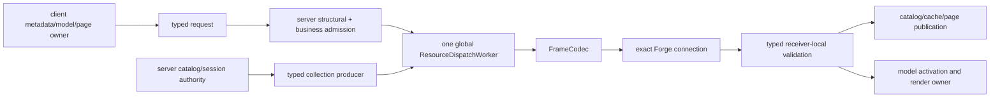

# 网络架构

> **适用问题**：连接与会话、消息路由、目录同步、资产分发和玩家状态裁决；**不包含**：wire 字段定义、模型解析和渲染资源内部布局。

当前网络以一个 Forge `EventNetworkChannel` 承载 model session、typed model distribution、玩家/entity 状态和控制消息。`NetworkHandler` 是唯一 frame/消息注册入口；exact connection 拥有 session 与 inbound transfer retirement；一个 server-global `ResourceDispatchWorker` 独占所有 accepted physical transmission。

边界如下：

- `FrameCodec` 只负责 simple/full frame、message tag、stored/decoded length、protobuf zstd、attachment 与 exact consumption；wire 常量由[当前协议](../../standards/protocol-v1/README.md)定义。
- Registry 唯一映射 ID、方向、Proto 类型、decoded 上限、attachment policy 和 handler。Transport 不解释 transfer key、member、sequence/offset、completion、authorization 或 publication。
- 每种 inbound 业务拥有自己的 assembly 与 terminal；验证规则见[协议](../../standards/protocol-v1/README.md)，不建立 generic reassembly owner。
- Exact connection 是唯一 retirement root。新 connection 不继承旧 publication/transfer ID、assembly 或 late outcome；server-global dispatch 仍是唯一 outbound scheduler。
- Server structural/business admission 与 source 创建顺序见[资产传输](asset-transfer.md#server-admission-与-source-closure)。
- Remote capability 范围见[协议](../../standards/protocol-v1/README.md#安全与能力边界)，cache physical confinement 见[Storage](../model-management/storage-and-cache.md)。
- Client model-session collection publication只提交 catalog、grants、pack presentation与default animation。Selection 继续由既有 ID 17 `PlayerStateUpdate.model` 路径同步，不与 collection transaction 联合发布。

输入校验与信任边界由[产品决策](../../product-decisions/decisions/trust-boundaries.md)定义。

连接与 session 状态见 [Transport 与 session](transport-and-session.md)，collection 发布见 [Catalog 同步](catalog-sync.md)，资源 owner 与调度见 [资产传输](asset-transfer.md)，玩家状态裁决见 [玩家状态与控制](player-state.md)，无法从当前结果反推的取舍见[网络决策理由](design-rationale.md)。

## 定位与交接

Java 网络实现集中在 `com.elfmcys.ysm.network`。按负责验证或发布的 owner 定位：

| 问题 | 符号入口 | 关键边界 |
|---|---|---|
| 帧被拒绝或消息未路由 | `NetworkHandler`、`frame.FrameCodec` | Registry、方向、长度与 exact consumption |
| 换服、协商或晚到消息 | `forge.ClientSessionRuntime`、`forge.SessionProtocolHandler` | Exact connection 与所属 session |
| Catalog 已到但模型不可用 | `forge.SessionCollectionPublication`、`RemotePublicationSnapshot`、`ActivationSnapshot` | Collection commit 与 content activation 分离 |
| 发送拥塞或某资源无法结束 | `dispatch.ResourceDispatchWorker` | Accepted transmission 的 cursor、terminal 与取消 |

服务端事实在 server game owner 上裁决；收到完整输入后的资源构造回到 model owner 所建立的有限工作。线程边界见[运行模型](../runtime-model.md)，metadata 与 chunk 内容验证见[资产管线](../asset-pipeline/container-and-validation.md)。Native 压缩/hash 只是 frame 或资源处理的计算步骤，不拥有网络 session。
