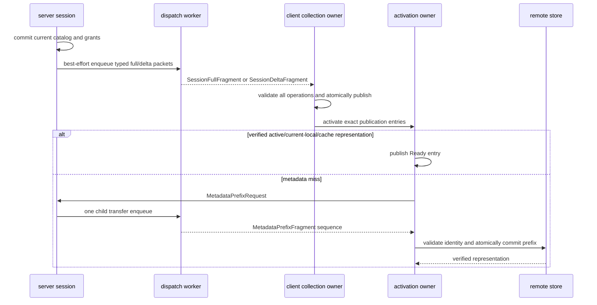

# Catalog 同步

Server 为每个 active model session 发布独立的 collection authority。`CatalogPublication` 只包含 `model_id`、`container_id`、hierarchy path 与 access；名称、description、icon、preview、metadata prefix 和 Manifest 不在 catalog collection 内。

## Server publication owner

每个 `ServerModelSession` 持有当前 catalog、按 container hash 建立的 lookup、grants 与 server selection facts。Catalog/grants 改变时先提交 server authority，再从 committed snapshot 构造 typed full/delta packets并 best-effort 交给唯一 global `ResourceDispatchWorker`。编码或 enqueue 失败不回滚 authority、不关闭 session，也不建立 retry/history/resync；后续 delta 仍以 server current snapshot 为 previous。

Server 从 committed snapshot 构造完整 typed operation，FULL/DELTA 的初值、覆盖与 canonical order 由[协议](../../standards/protocol-v1/README.md)定义。

Session close 先 seal 新 request，取消该 session 的 active resource transfers，再由 dispatch owner关闭已 accepted transmissions，最后撤销 transport 与 publication references。关闭一条 session 不影响其他玩家或 global catalog。

## Client collection authority 与 activation

Client collection owner 按[协议](../../standards/protocol-v1/README.md)验证并将全部 operation 应用到不可见 candidate，再一次替换四个 collection。Wire/domain 无效与 retained baseline 不兼容的不同处置见[失败处理](../model-management/failure-and-recovery.md)。

Collection transaction 不包含 selection。既有 ID 17 `PlayerStateUpdate.model` / `ModelSelectionState` 仍独立拥有 selection 的 sender、consumer、fallback 与 reconnect 行为；它按当前机会 best-effort 投影，不维护 revision/order。`SelectModelResult` 只返回请求 disposition。Collection publication 不等待、调用或协调 ID 17 sender，也没有跨消息 ordering/rollback contract。

每个 publication entry 的 activation独立处于 Pending、Ready 或 Failed：

- 按[Catalog 的 representation 查找顺序](../model-management/catalog-and-sources.md)解析 publication；本地来源证明与远端 exact 边界也由该页定义；
- metadata miss 交给[typed action owner](asset-transfer.md#typed-request-与-action-owner)聚合并按需分 child；
- prefix 通过[分层验证](../asset-pipeline/container-and-validation.md)并按[Storage](../model-management/storage-and-cache.md)原子提交后才产生 Ready representation；
- 已terminal的Ready/Failed state可按exact tuple保留；publication在metadata action pending期间变化时，activation owner整体取消旧action、退休其全部pending entry owner，并为current publication的全部Pending entry重建一次共同action；
- entry的wire/content失败彼此隔离；旧publication的local supersession不会伪装成current sibling failure，迟到 outcome不能覆盖replacement。

Transient entry 由显式操作重建，不定时重试。Disconnect 按[Transport](transport-and-session.md)撤销 remote owner，再按[Reload](../model-management/reload-and-publication.md)恢复 local authority。

进程 Local Catalog 在 remote session 期间继续持有并更新完整内容；它不是 session query table，也不因 remote authority 进入 index-only。Disconnect 只是撤销 session projection并立即切回最新 local snapshot。Direct 来源的内嵌 preview 准入由 Local Catalog 自己完成，不由 server publication 或客户端独立 preview cache补足。

## Selection 与 request admission

Selection 经 ID 17 player-state path 同步；model-session 提供 catalog/grants 和 request-time authorization facts。展示和 cache 命中不构成授权，业务边界见[model-authorization](../../product-decisions/decisions/model-authorization.md)，具体 wire 接纳见[协议](../../standards/protocol-v1/README.md#选择授权与状态顺序)，source 创建前的交接见[资产传输](asset-transfer.md#server-admission-与-source-closure)。

当前 server-private forced-selection mode 仅为绑定的 `ModelId` 放行普通 chunk，不写 grants 或 wire，也不授权其他模型；清除 mode 仅阻止新请求。它相对 `RESTRICTED_AUTH` 的产品例外仍未裁决，见[Q-09](../../complexity-map/java-models-and-network/open-questions.md#q-09)，不能据实现补写产品规则。

协议兼容边界见[session-failure](../../product-decisions/decisions/session-failure.md#ddprotocol-compatibility-has-bounded-cost)。
