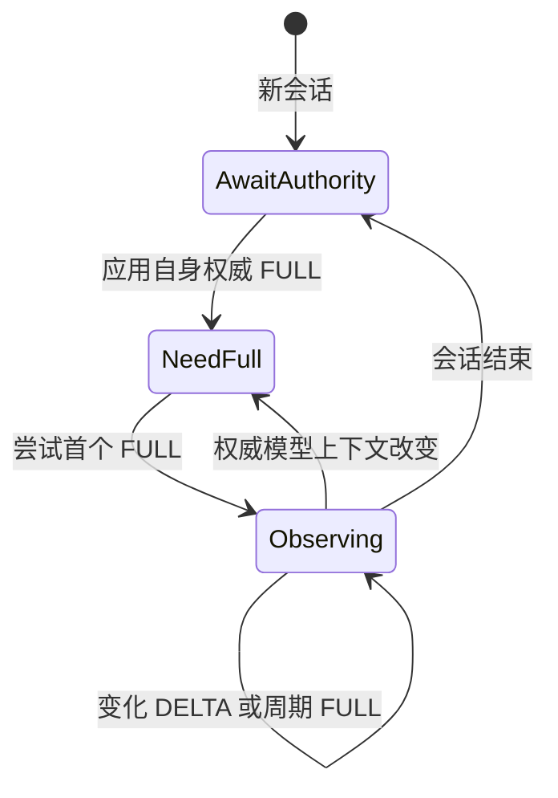
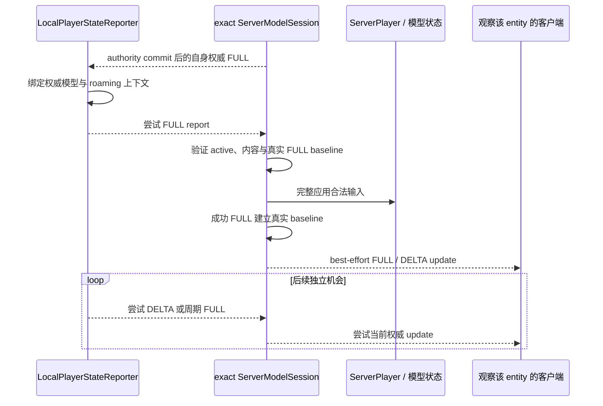

# 玩家状态与控制

## 权威模型

按[player-state-sync](../../product-decisions/decisions/player-state-sync.md)与[model-authorization](../../product-decisions/decisions/model-authorization.md)确定权威边界。`LocalPlayerStateReporter` 只报告当前会话允许的 animation 与 Roaming；`PlayerStateHandler` 从已认证 sender 和 exact `Connection` 确定主体与 owner，结合游戏状态、模型权限和语义验证后生成下行更新。

| 状态或操作 | 当前来源与裁决 |
|---|---|
| 模型与纹理选择 | 客户端发送请求；服务端按配置、目录和授权裁决并回送权威状态。 |
| gameplay / effects | 由 Game Server 的 `ServerPlayer` 与 `level` 状态生成，不接受客户端自报为权威。 |
| animation / roaming | 客户端按协商范围报告；服务端校验模型语义后应用。 |
| 收藏快照 | 服务端发送当前完整集合；客户端验证全部 hash 后一次替换本地投影。 |
| Molang、挥手、实体动画 | 客户端发送受限请求；服务端验证主体、目标和内容后执行或广播。 |
| 投射物与载具模型状态 | 由游戏服务端下发，客户端绑定到对应实体。 |

控制消息表达“请求”或“事件”，不能被客户端直接当作已经生效的权威状态。模型切换和额外动画等待服务端权威回送；本地乐观状态不得绕过权限检查。

Selection、PlayerState 与其余 C2S 控制请求在握手 ACCEPT 后即属于可发送业务，不等待 catalog publication。Catalog 只决定目录、展示与资源取得；其延迟或失败不得关闭业务 seam。Selection 仍由服务端裁决，握手就绪不把客户端请求提升为权威状态。

Local player 的选择发送和运行资源请求在进入各自网络/资源 owner 前，分别应用[当前连续意图](../client-presentation/README.md#选择与显示的分离)门槛。该门槛只过滤快速切换产生的尚未发送效果，不改变服务端 authority，也不创建发送等待、完成或失败恢复状态；每个 remote entity 的资源需求独立计时，不能借另一个玩家的稳定选择提前发送。

PlayerState、Roaming 与 `ysm.sync` 如何进入客户端动画运行时，见[动画状态输入与同步](../animation/state-inputs-and-sync.md)。

## 客户端报告机会

`LocalPlayerStateReporter` 只保存当前业务会话、权威模型上下文、当前观测和初始/周期 FULL 的时序。业务会话在 ACCEPT 提交后建立，不读取 client catalog `ACTIVE`；新会话或模型上下文改变后，没有自身权威 FULL 时仍不生成依赖模型或 Roaming 上下文的报告。Server 在 session active、选择解析与 catalog authority commit 后先发送该 self FULL，再入队 collection publication；取得权威后，首个有效机会形成 FULL，之后的独立变化机会形成 DELTA，周期机会重新形成当时的 FULL。

一个有效机会在调用宿主发送前就推进当前观测、首次机会和周期时序；本地编码或提交成功与否都不产生发送后回写、dirty 恢复或下一 tick 重放。发送调用只表示本次本地提交尝试，不证明 peer 收到或接受。首个 FULL 丢失后，服务端可以继续拒绝无真实 baseline 的 DELTA，直到某个后续周期 FULL 独立到达；不会因此立即补发。

模型选择的当前连续意图仍是正常输入门槛，但不等待其发送完成，也不因失败回滚已裁决的本地或服务端事实。当前协议对这些表现消息不提供 ACK、去重、重放或有序投递保证，合法消息可以遗漏、重复、延迟或造成暂时漂移。

## 服务端应用与下行投影

Ingress 在网络入口捕获 sender 与 exact `Connection`，排队到 owner thread 后通过 `ServerModelService` 的同一 registry 重验它仍属于捕获的 `ServerModelSession`。Handler 再检查 active session、协商策略、主体、模型与数值约束。只有完整应用成功的 FULL 才在该 model session 建立真实报告 baseline；没有 baseline 的 DELTA 直接拒绝。报告资格和 baseline 不再由独立 registry、cursor 或生命周期状态机维护。

状态应用成功后，服务端按本次权威内容尝试下行通知。构造或广播失败不回滚游戏事实或已经建立的 FULL baseline，也不留下待广播、失败或恢复状态；后续独立广播机会不受该次失败阻止。客户端只在捕获的 connection 仍 current 且整个消息有效时按到达机会应用 FULL/DELTA，不维护 per-entity revision。重复、延迟或旧合法内容因此可能覆盖较新的投影，这是当前 best-effort 成本，不通过隐藏排序字段恢复可靠复制。

当前 Game Server 使用 `Entity#getId()` 构造 `EntityRef.entity_id`，并在当前 `level` 中解析；`EntityRef.player_id` 禁用。未来 Backend 即使启用稳定玩家路由键，也必须以已认证 transport peer 决定写入主体，路由键不能替代认证。尚未闭环的实机验证见[当前支持状态](../../status/support-and-verification.md)。

## 追踪范围与输入补全

Minecraft tracker 开始追踪时尝试发送当前 FULL，后续 tick 形成变化后尝试 DELTA；本地 reporter 的周期机会形成 FULL。每次都是独立 best-effort 通知，不因之前失败重放旧消息。可观察义务见[player-state-sync](../../product-decisions/decisions/player-state-sync.md)。

确定要补充的输入时，需要核实目标游戏版本实际对 RemotePlayer 下发并应用哪些状态；字段或 accessor 存在、LocalPlayer 可读均不足以证明已经同步。服务端权威值从服务端取得，本地独有操作经校验形成模组投影；不得写回原版玩法权威。
