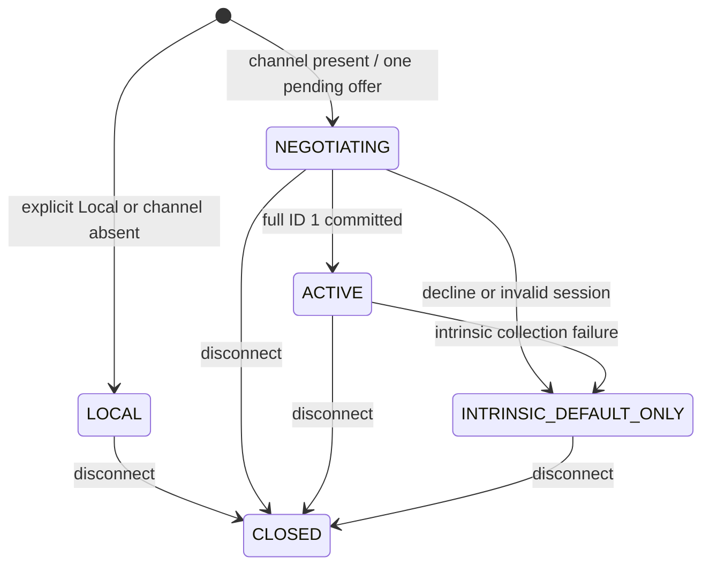

# Transport 与 session

Channel presence 决定是否尝试 model session，显式 Local 不主动建立；版本与会话失败边界见[当前协议](../../standards/protocol-v1/README.md)和[session-failure](../../product-decisions/decisions/session-failure.md)。

下图描述 client catalog 生命周期，不表示业务消息资格：

状态语义：

- `LOCAL` 使用本地 catalog。显式 Local 收到 `ServerHello` 时最多 decline 一次。
- `NEGOTIATING` 只持有一个 connection-owned hello offer 和 full candidate。`ACCEPT` 已提交后可以同时存在业务就绪但 catalog 仍在协商的状态；`/ysm ping` 重发同一 pending hello，不创建第二 session。
- `ACTIVE` 只表示已提交的 collection authority 与独立 activation state。Active ping 只探测连通性，不替换 owner、不重置 publication/data-transfer ID，也不重启 transfer。
- `INTRINSIC_DEFAULT_ONLY` 只渲染 intrinsic default，直到重连；不能回退到可能与 server authority 不一致的本地 catalog。Catalog failure 到达该状态时保留已握手的业务资格；协议失败到达该状态时撤销资格，因此不能从此枚举反推业务可用性。
- `CLOSED` seal 新 work，并关闭该 connection 的业务资格、publication assembler、typed distribution owner、activation 与 transport capability。

业务资格由一个 connection-owned `BusinessSession` 投影表达，包含 exact `Connection` 与已协商 policy。Client 仅在 `SessionResponse.ACCEPT` 成功交给 transport 后发布该投影；相同 pending Hello 复用同一实例。Selection、PlayerState、收藏与控制请求读取这一 seam，不读取 catalog `ACTIVE`。Server 在 owner thread 执行业务前仍复核 exact session 已 active；有序 transport 使 ACCEPT 先于同连接后续业务包，不需要额外 ACK。

失败按 provenance 收敛：collection assembly、commit 或 activation 失败只关闭 catalog/resource owner 并进入 intrinsic default，保留 `BusinessSession`；版本/非法 frame/冲突 Hello 等协议失败，以及 disconnect/replacement，才同时撤销业务资格。`SessionResponse.DECLINE` 只有在同一 server model session 成功执行 `PENDING -> DECLINED` 时生效；ACTIVE/DECLINED 后的 late 或 duplicate response 是 no-op。Player-state 的真实 FULL baseline 仍属于同一 exact server model session，不另建 generation 或恢复 owner。

跨联机会话的网络隔离复用 Minecraft 网络框架：完全退出服务器或存档后，整个 Netty executor 会 drain，模组无需为框架已保障的边界重复增加跨会话隔离状态与协调机制。该宿主边界不替代 YSM 的 exact Connection 路由检查和本侧 work 退役。

Wire 不携带 `session_id`。Server callback 的来源玩家与 exact `Connection` 是路由事实；每条 connection 至多一个 model session。网络线程在 enqueue 时捕获 exact connection，owner thread 执行时再次确认它仍是 current，不能按玩家 UUID 或 global current 借用 replacement session。

Publication 与 model distribution 各自持有 connection-scoped ID stream，只有 replacement connection 重置；版本、ID 范围、起值和拒绝规则统一见[当前协议](../../standards/protocol-v1/README.md)。

Frame decoder 在业务 dispatch 前执行[协议](../../standards/protocol-v1/README.md)的 frame 验证。Transport 不保存业务 assembly；超帧的 collection 与 metadata/model/page 由各自 receiver owner 维护 bounded coverage。

新连接与显式 disconnect 使用同一清理 seam：先摘除 current connection，使旧 admission/publication 失效，再关闭 connection-owned typed transfers、assembly、activation 与玩家/entity/world projection。迟到 work 只能关闭自己仍拥有的数据或丢弃结果，不能写 replacement authority。进程 Catalog、client/server runtime worker、合法 Ready、registered image 与 chunk cache 不属于 connection owner；disconnect 不等待或清空它们，client 直接投影最新 local snapshot，见[Reload 与发布](../model-management/reload-and-publication.md)。

Server stopping path 关闭该 game server service 的 session accepted transfer 与 global dispatch；进程 Catalog/worker 只由进程 owner 关闭。Session 与进程的不同结束边界见[所有权与生命周期](../model-management/ownership-and-lifecycle.md)。

Disconnect 不清除已验证 remote disk cache、本地文件、最新 local index、converted/baked cache、配置或 server 持久 selection。Player-state 与 ID 17 selection 仍走独立消息路径，但都只在捕获的 exact connection 仍 current 时生效；Selection 请求属于握手后的业务消息，不等待 catalog publication。表现消息不维护跨连接 sequence/revision，见[玩家状态与控制](player-state.md)。
