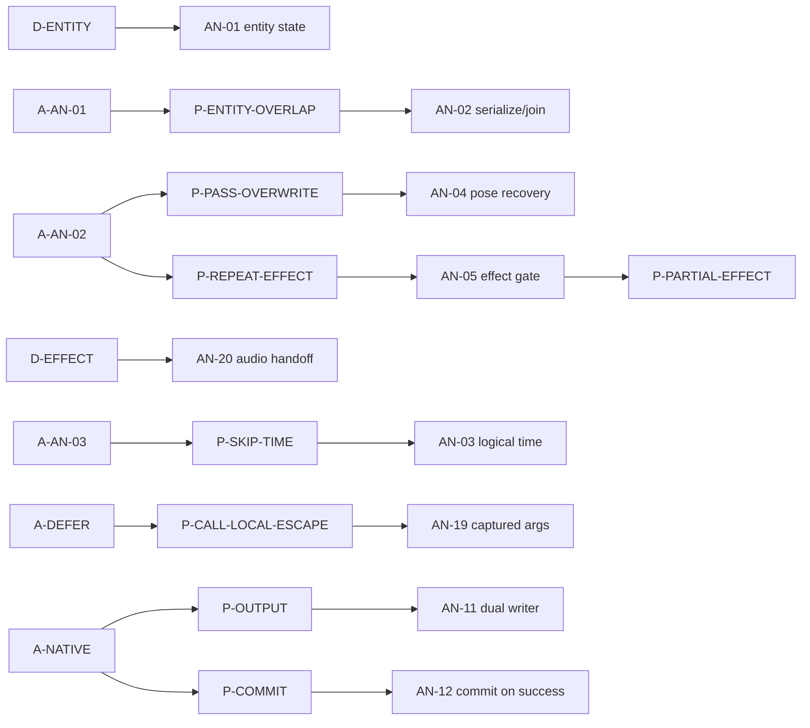

# 因果图与高扇出候选

本页拥有 AN 内部关系的唯一登记；跨子系统关系见[跨子系统关系](../governance/cross-subsystem-relations.md)，全局 R/D 排名见[全局高扇出候选](../governance/global-fanout.md)。

## 局部因果图

## 高扇出候选

| 候选 | 影响的本地机制 | 局部解释 |
|---|---|---|
| `A-AN-02` | AN-04/05 | 多 pass 共用历史同时产生姿态污染与动作重复风险 |
| `A-NATIVE` | AN-11/12 | 跨语言输出既需要 consumer 适配，也需要失败前不提交 |
| `D-FAIL/D-EXT/D-HOST` | AN-10/12 | 可选联动和宿主输出拥有不同失败边界，不能合成一个 fallback |
| `D-SOUND/D-EFFECT` | AN-20 | 模型声音使用主时间线 effect 资格，并独立闭合 host adoption |
| `D-LOOP`（扩展候选） | AN-02/03 | 主循环目标能解释优化方向，不能证明原地异步和当前限频策略必需 |
| `H-BLEND/H-FENCE` | AN-08/13 | 现存机制有 Fact，根理由仍是 Hypothesis，不进入 Fact 高扇出计数 |

## 局部因果与删除边界

| 子图 | 派生负担与可改变前提 | 不随上游自动消失的义务 |
|---|---|---|
| `A-AN-01 → AN-02` 与 `A-AN-02 → AN-04/AN-05` | 原地异步求值带来串行/汇合；多 pass 共用历史带来姿态恢复。显式 fence AN-13 的独立理由仍缺证据 | 单实体隔离、动作次数、Ready lease、native view 有效期；取消异步不证明可删多 pass 或动作门禁 |
| `AN-05 → P-PARTIAL-EFFECT` | 解释器在求值窗口内直接提交宿主 effect，原先的 batch/eligibility 收口已不存在；能力门禁本身不能保证半次动作安全 | Observation 仍不得提交，generation 切换与旧表现不污染仍需保持；半次动作当前没有回滚或丢弃保证，不能声称该风险已收口 |
| `A-DEFER → P-CALL-LOCAL-ESCAPE → AN-19` | 延后执行带来参数留存和排空顺序；改调度可收缩留存窗口，但需保持既有动作语义 | Entity 隔离、capture 值含义、模型切换/结束时的排空终态；如改变可观察顺序，需要回到产品/兼容边界裁决 |

这些子图是下方本地关系表的投影。AN-08/13 的根仍为假设，不能因局部扇出低而从主体删除；同样不能把“开放 ABI 一定不安全”当作已验证理由。

## Fact 因果关系

| From | Type | To | Basis |
|---|---|---|---|
| D-ENTITY | requires | AN-01 | AN-01 |
| A-AN-01 | creates | P-ENTITY-OVERLAP, P-LIVE-INPUT, P-LOOP-WAIT | AN-02；后两项无已闭合解决机制 |
| P-ENTITY-OVERLAP | addresses | AN-02 | AN-02 |
| A-AN-02 | creates | P-PASS-OVERWRITE, P-REPEAT-EFFECT | AN-04/05 |
| P-PASS-OVERWRITE | addresses | AN-04 | AN-04 |
| P-REPEAT-EFFECT | addresses | AN-05 | AN-05 |
| D-EFFECT | requires | AN-05 | AN-05 |
| D-EFFECT | requires | AN-20 | AN-20：声音触发只能由有 effect 资格的主时间线提交 |
| AN-05 | creates | P-PARTIAL-EFFECT | AN-05：logical action 获得 effect 能力，执行中仍可能失败；当前无已闭合的收口机制 |
| A-DEFER | creates | P-CALL-LOCAL-ESCAPE | AN-19：延后执行跨越 call-local 参数寿命 |
| P-CALL-LOCAL-ESCAPE | addresses | AN-19 | AN-19：求值快照与逆序排空；Forge 时序核验仍有缺口 |
| A-AN-03 | creates | P-SKIP-TIME | AN-03 |
| P-SKIP-TIME | addresses | AN-03 | AN-03 |
| D-CONTROLLER | requires | AN-06 | AN-06 |
| D-VANILLA-ACTION | requires | AN-06 | AN-06 |
| D-AN-FALLBACK | requires | AN-06 | AN-06 |
| A-AN-04 | requires | AN-09 | AN-09 |
| D-EXT | requires | AN-10 | AN-10 |
| P-OUTPUT | addresses | AN-11 | AN-11：宿主不总有可识别连续布局 |
| P-COMMIT | addresses | AN-12 | AN-12：native 准备后失败 |
| D-HOST | requires | AN-12 | AN-12 |

## 非因果关系与候选扩展

| From | Relation / Confidence | To | 含义 |
|---|---|---|---|
| AN-10 | depends / Fact | AN-09 | 当前反射产物协议依赖生成器；可选隔离义务有独立产品来源 |
| AN-11 | preserves / Fact | D-OUTPUT | 产品要求等价，不要求具体双路径实现 |
| AN-02 | conflicts / Fact | D-LOOP | 跨阶段 Future 等待与现有禁止条款冲突 |
| AN-03 | conformance-pending / Hypothesis | D-SAMPLE | 限频已获允许，具体实现的整体表现与因果保持仍待验证 |
| H-BLEND | motivates / Hypothesis | AN-08 | 历史混合问题是否仍构成受保护作品语义 |
| H-FENCE | motivates / Hypothesis | AN-13 | 任务完成同步之外是否有独立可见性缺口 |
