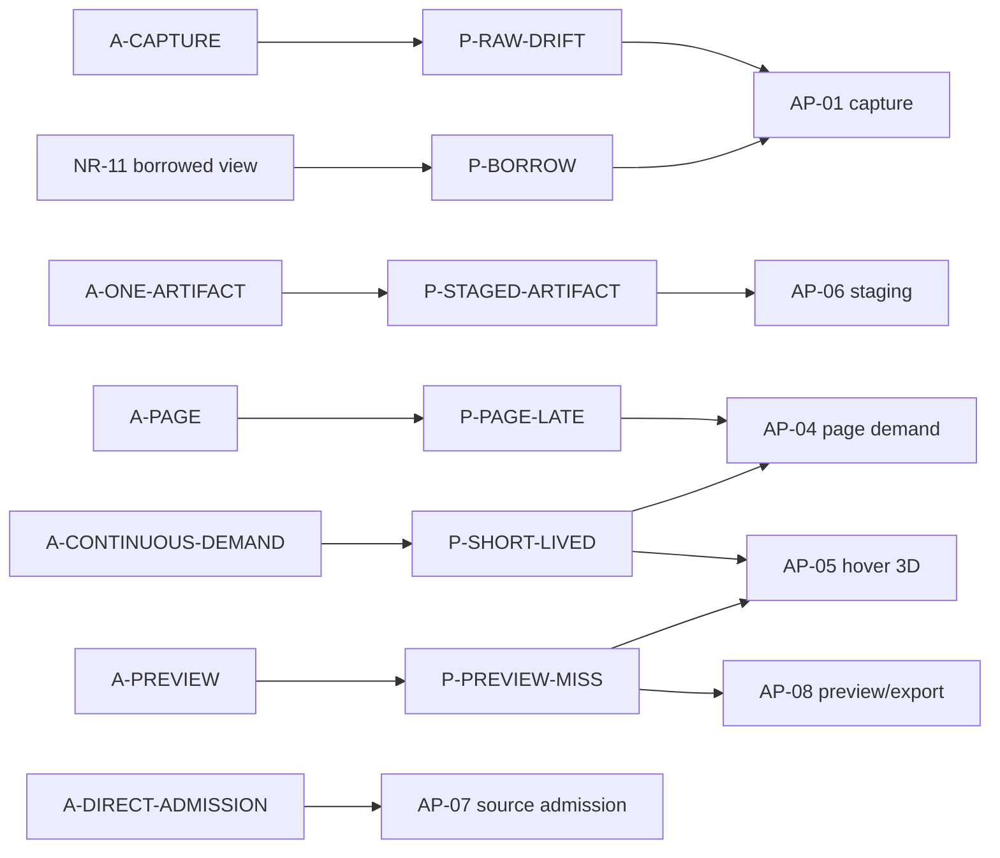

# 因果图与高扇出候选

本页拥有 AP 内部关系的唯一登记；跨子系统关系见[跨子系统关系](../governance/cross-subsystem-relations.md)，全局 R/D 排名见[全局高扇出候选](../governance/global-fanout.md)。

## 局部因果图

## 高扇出候选

| 候选 | 影响的本地机制 | 局部解释 |
|---|---|---|
| `D-SOURCE` | AP-06/07/08 | 转换交付、direct 准入和独立 preview/export 分别保留 owner |
| `D-JOIN/D-CHUNKS/D-META/D-VERIFY` | AP-02/05 | 分层内容可用性与浏览不下载模型共同来自按需内容边界 |
| `D-FREEZE` | AP-01/06/08 | 输入、staging 与 export 分别闭合语义冻结 |
| `D-SOUND/D-MIGRATION` | AP-09 | Raw 与 legacy 通过同一 current 音频 profile 交付，metadata 与完整内容分阶段验证 |
| `A-CONTINUOUS-DEMAND` | AP-04/05 | 页面与 hover 共享短命意图原则，但拥有独立门槛和终态 |
| `A-PREVIEW` / `A-PREVIEW-CACHE` | AP-05/08 | 3D 探测和图片取得是两个可分别替换的展示选择 |
| `A-ARCHIVE` | AP-01 | Native 借用协议把“下次读取前复制”加入 capture 约束 |

## 局部因果与删除边界

| 子图 | 附属机制及退出条件 | 仍有独立来源的义务 |
|---|---|---|
| `A-CAPTURE → P-RAW-DRIFT → AP-01`；`NR-11 → P-BORROW → AP-01` | 分阶段解析需要固定输入，archive 借用又要求及时复制。同一个 capture 同时承接两个来源 | 改 owning archive 只消除“下次读取前复制”的时间耦合，不消除 scan/compile 的来源一致性 |
| `A-ONE-ARTIFACT → P-STAGED-ARTIFACT → AP-06`；AP-06 使用 AP-02 | 转换后统一为当前容器，需要独立产物交接与可读性验证；调整交付表示可减少 staging I/O | NR-13 的跨语言 payload owner、内容投影保真、MN-05 的存储提交和 MN-01 的目录发布各有失败边界 |
| `A-PAGE → P-PAGE-LATE → AP-04`；AP-04 使用 MN-17 | 页面离开不等于共享后台工作完成，需撤需求并处置迟到结果 | 更换页面加载策略不能关闭其他消费者的 Ready lease；standalone GUI texture 与 model texture 发布 owner 不同 |
| `A-CONTINUOUS-DEMAND → P-SHORT-LIVED → AP-04/AP-05` | 页面、hover 和实体只保留当前意图及起点；取消门槛可删除这些短期状态 | 已命中内容及时交付、各流独立和页面关闭终态仍需保持 |
| `A-PREVIEW → P-PREVIEW-MISS → AP-05/AP-08` | Preview-first 与独立 cache 分别承接展示 miss；取消 3D hover 可缩 AP-05，但不能删除图片取得 | 浏览不得驱动全量模型下载；AP-08 的弱关联、export 和 AP-03 raw 输入策略仍独立 |
| `A-DIRECT-ADMISSION → AP-07`；`A-PREVIEW-CACHE → AP-08` | 改变来源政策或图片存储选择后可分别替换 | Schema 合法性、模型内容验证、作者图保留和来源只读不随实现一起消失 |

上图和删除边界由下方本地关系表支持，不把转换→存储→目录→页面的普通数据流当成因果链。AP-03 的策略效果与成本、AP-05 的体验收益仍需证据，低扇出不降低其记录价值。

## Fact 因果关系

| From | Type | To | Basis |
|---|---|---|---|
| D-JOIN | requires | AP-05 | AP-05：保留 3D 卡片时不因浏览取模型 |
| D-VERIFY | requires | AP-02 | AP-02 |
| P-PAGE-LATE | addresses | AP-04 | AP-04 |
| D-FREEZE | requires | AP-01, AP-08 | AP-01：身份与产物消费同份输入；AP-08：export 冻结完整输出 |
| A-CAPTURE | creates | P-RAW-DRIFT | AP-01：分阶段解析间来源可能变化 |
| P-RAW-DRIFT | addresses | AP-01 | AP-01 |
| A-ONE-ARTIFACT | creates | P-STAGED-ARTIFACT | AP-06：转换完成不证明写出的当前容器可读 |
| P-STAGED-ARTIFACT | addresses | AP-06 | AP-06：staging 与重开验证 |
| D-FREEZE | requires | AP-06 | AP-06：交付物承接本次冻结语义 |
| D-MIGRATION | requires | AP-09 | AP-09：legacy 声音投影为 current profile 并由 Java 复验 |
| A-IMAGE | creates | P-CODEC-FAIL | AP-03：raw 图片重编码可能失败 |
| P-CODEC-FAIL | addresses | AP-03 | AP-03：可处理 codec I/O 失败保留原图 |
| A-PAGE | creates | P-PAGE-LATE | AP-04 |
| A-PREVIEW | creates | P-PREVIEW-MISS | AP-05/08：离线缺失不能污染正常加载，图片可独立取得 |
| P-PREVIEW-MISS | addresses | AP-05, AP-08 | AP-05/08 |
| A-DIRECT-ADMISSION | requires | AP-07 | AP-07：实际来源准入与 schema 合法性分层 |
| A-PREVIEW-CACHE | requires | AP-08 | AP-08：弱关联独立图片不回写容器 |
| NR-11 | creates | P-BORROW | NR-11/AP-01：后读可覆盖前读 |
| P-BORROW | addresses | AP-01 | AP-01 |

## 非因果关系与候选扩展

| From | Relation / Confidence | To | 含义 |
|---|---|---|---|
| AP-07 | depends / Fact | AP-02 | 来源策略门禁建立在 schema/content 验证之上，不把 policy 写进 reader |
