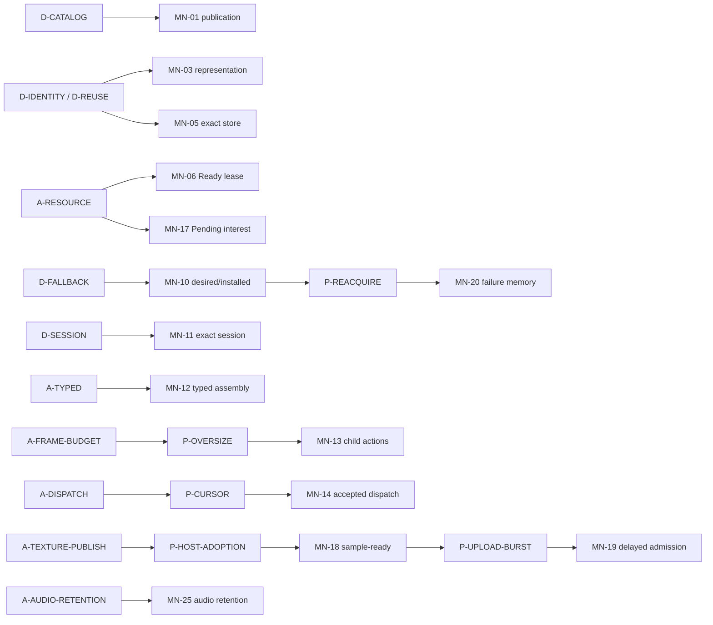

# 因果图与高扇出候选

本页拥有 MN 内部关系的唯一登记；跨子系统关系见[跨子系统关系](../governance/cross-subsystem-relations.md)，全局 R/D 排名见[全局高扇出候选](../governance/global-fanout.md)。

## 局部因果图

## 高扇出候选

| 候选 | 影响的本地机制 | 局部解释 |
|---|---|---|
| `D-CATALOG/D-HOLD/D-EXACT` | MN-01/05/06 | 完整目录、精确读取和已有使用保活是不同生命周期义务 |
| `D-IDENTITY/D-REUSE` | MN-03/05 | 同源替代与字节精确 cache 同时存在 |
| `D-JOIN/D-CHUNKS/D-META/D-VERIFY` | MN-02/12 | Catalog 分层可用与 typed assembly 共享按需内容根 |
| `A-RESOURCE` | MN-06/17 | Ready 可达性与 Pending interest 不能由一个引用计数替代 |
| `D-DEFAULT/D-FALLBACK/D-HOST-FALLBACK` | MN-08/10 | required default 与运行期分类降级分别闭合 |
| `A-TEXTURE-PUBLISH` | MN-18/19 | host 完整接纳产生 ordinary publication 调度负担 |
| `D-CAPABILITY` | MN-12/22 | typed admission 与物理 filesystem sink 分别限制远端能力 |
| `A-CONTINUOUS-DEMAND/A-FAILURE-MEMORY` | MN-10/20 | 当前意图和 exact 失败资格共同控制重复请求，但 owner 不合并 |
| `A-AUDIO-RETENTION` | MN-25 | 一个账本统一 encoded/PCM 保留，避免双预算与第二 cache authority |

## 局部因果与删除边界

以下是本页关系表的语义压缩；沿 `→` 读原因与后果，跨机制的使用/协调另看非因果关系，不据此将整组一并删除。

| 子图 | 可整体退出的条件 | 仍有独立来源的义务 |
|---|---|---|
| `A-RESOURCE → MN-17`：共享 Pending 工作 → 最后 interest/迟到完成协调；`A-RESOURCE → MN-06`：共享 Ready → 引用保活 | 不再共享待完成工作，才可能去掉 interest 聚合；改变完成资源的 owner 方案才可能替换可达性管理 | 多消费者已取得的资源仍有效；cancel 不能等同 physical close，session 身份仍由 MN-11 保证 |
| `D-HOLD → MN-05`；文件型 content 的未来读取用精确实例排序，已完成资源由 MN-06 可达性保活 | 取消 direct 副本已移除完整复制、专属锁和清理；若取消延迟读取才可能进一步删除 source-instance 状态 | Direct 原件未来读取允许局部失败；已开始读的完整验证、用户来源处置权和 cache bytes 验证仍独立 |
| `A-TEXTURE-PUBLISH → MN-18 → P-UPLOAD-BURST → MN-19`：host 发布 → 集中 owner 工作 → 延后 admission | Host 发布策略或有证据的调度预算改变后，可收缩排队及等待期 guard | GPU/host thread affinity、失败 candidate 不污染 Ready、旧 lease 保活仍在；仅改队列名称无收益 |
| `MN-10 → P-REACQUIRE → MN-20`：保留恢复机会 → 同条件再请求 → exact 失败记忆 | 将失败资格在同一 domain 中统一表示，证明不同 request/content 仍能恢复 | Flight 终态退出；模型请求、target 内 lazy 资源与 preview miss 的失败边界不同，不能拼成全局永久失败表 |
| `A-REMOTE-FILES → MN-22` 与 `A-SHARED-CACHE → MN-23` | 移除对应文件型 sink 或共享 writer 选择，分别评估删除 | 不同 cache 的来源保护、完整发布和 exact identity 仍成立；跨进程锁不能替代物理路径约束 |
| `A-CONVERTED-CONSUMERS → MN-24` | 不再跨进程共享 converted，或采用能证明活跃使用的更小方案，才可退出登记与清理许可 | 用户来源只读、精确对象验证和一次 scan 保留集合仍独立；不得扩大为所有 cache 的清理 owner |

## Fact 因果关系

| From | Type | To | Basis |
|---|---|---|---|
| D-RELOAD | creates | P-INVENTORY | MN-01：运行期可变来源 |
| D-CATALOG | requires | MN-01 | MN-01 |
| P-INVENTORY | addresses | MN-01 | MN-01 |
| A-NOTIFY | requires | MN-02 | MN-02：事实与通知分离 |
| D-REUSE | requires | MN-03, MN-05 | MN-03/05 |
| D-CAPABILITY | requires | MN-12, MN-22 | Typed capability 与文件型 cache 的物理 sink 约束 |
| D-HOLD | creates | P-SHARED | MN-06：已持有使用跨目录退役存续 |
| D-HOLD | requires | MN-05 | 已验证 remote/converted exact 目标的坏读或替换失败不能破坏当前对象；direct 未来读取允许局部失败 |
| A-RESOURCE | requires | MN-06, MN-17 | 已完成可达性与未完成 interest 是两个独立机制 |
| P-SHARED | addresses | MN-06 | MN-06 |
| A-TEXTURE-PUBLISH | creates | P-HOST-ADOPTION | MN-18：native/解码成功不等于 host 纹理可采样 |
| P-HOST-ADOPTION | addresses | MN-18 | MN-18 |
| D-HOST | requires | MN-18 | MN-18：失败 candidate 不污染已发布表现 |
| MN-18 | creates | P-UPLOAD-BURST | MN-19：host publication 集中在 render owner |
| A-PUBLISH-BUDGET | requires | MN-19 | MN-19：ordinary terminal disposition 调度是当前选择 |
| P-UPLOAD-BURST | addresses | MN-19 | MN-19，不证明 4/2 是性能最优 |
| A-CONVERTED-CONSUMERS | requires | MN-24 | MN-24：跨进程活跃消费者登记与短期清理许可 |
| A-AUDIO-RETENTION | requires | MN-25 | MN-25：统一预算、TTL/LRU 与 PCM 替代是当前客户端保留选择 |
| D-SESSION | requires | MN-07, MN-11 | MN-07/11 |
| D-DEFAULT | requires | MN-08 | MN-08 |
| A-DEFAULT-MEM | requires | MN-08 | MN-08：内存 resident default |
| D-FALLBACK | requires | MN-08, MN-10 | MN-08/10 |
| D-HOST-FALLBACK | requires | MN-10 | MN-10 |
| D-RECOVER | requires | MN-20 | 模型请求与 lazy 资源失败维持恢复/重复失败边界 |
| MN-10 | creates | P-REACQUIRE | MN-20：保留恢复机会使同条件重复请求成为可能 |
| A-FAILURE-MEMORY | requires | MN-20 | 模型请求与 lazy 资源的诊断脱离已结束的 Flight |
| P-REACQUIRE | addresses | MN-20 | MN-20 |
| D-SESSION-FAIL | requires | MN-11 | MN-11 |
| D-WIRE | requires | MN-11 | MN-11：单条当前 wire path |
| D-VALIDATE | requires | MN-12, MN-16 | MN-12/16 |
| D-ACCESS | requires | MN-12 | MN-12 |
| A-TYPED | requires | MN-12 | MN-12：业务局部 owner 承担自身 assembly |
| P-ASSEMBLY | addresses | MN-12 | MN-12 |
| A-FRAME-BUDGET | creates | P-OVERSIZE | MN-13：descriptor 可能超帧 |
| P-OVERSIZE | addresses | MN-13 | MN-13 |
| A-DISPATCH | creates | P-CURSOR | MN-14：accepted source、cursor 与背压 |
| P-CURSOR | addresses | MN-14 | MN-14 |
| D-ADMISSION | requires | MN-14 | MN-14：accepted source 固定授权结果 |
| A-FORCED | creates | P-FORCED | MN-15：特权的范围及保持/清除 |
| P-FORCED | addresses | MN-15 | MN-15；产品必要性仍 Uncertain |
| A-REPORT | requires | MN-16 | MN-16：当前报告协议的真实基线与 best-effort 机会 |
| D-SERVER | creates | P-REPORT | MN-16 |
| P-REPORT | addresses | MN-16 | MN-16 |
| D-PLAYER | requires | MN-16 | MN-16 |
| D-TRACKING | requires | MN-16 | MN-16 |
| D-SCRIPT | requires | MN-16 | MN-16 |
| A-REMOTE-FILES | creates | P-PHYSICAL-PATH | MN-22：文件系统链接/替换影响实际 sink |
| P-PHYSICAL-PATH | addresses | MN-22 | MN-22 |
| A-SHARED-CACHE | creates | P-SHARED-WRITER | MN-23：多个调用/进程可能 materialize 同 key |
| P-SHARED-WRITER | addresses | MN-23 | MN-23：锁、取锁后重验与 lock entry 退出 |

## 非因果关系与候选扩展

| From | Relation / Confidence | To | 含义 |
|---|---|---|---|
| MN-17 | coordinates / Fact | MN-11, MN-12 | 最后 interest 请求 exact transfer owner 取消 |
| MN-17 | depends / Fact | MN-18 | 成功 candidate 通过 host publication 后才成为 Ready |
| MN-19 | depends / Fact | MN-17, MN-18 | 等待期间依赖 exact Flight guard，出队仍走同一 Ready 门禁 |
| MN-10 | depends / Fact | MN-06, MN-17 | 保留旧 Ready，等待/取消新 candidate 是不同使用方式 |
| MN-20 | coordinates / Fact | MN-10, MN-17 | 失败资格不延长 Flight/transfer authority |
| MN-05 | depends / Fact | MN-22 | Remote 文件分支在读/写/损坏清理时都受物理 root 约束 |
| MN-06 | depends / Fact | MN-05 | 文件型 content 保活还需要精确读取实例；Ready 强引用不保证未来 direct 原件仍可读 |
| MN-24 | coordinates / Fact | MN-01, MN-05 | Scan 提供本次保留集合；converted 对象提交与 prune 共享同一消费者资格边界 |
| MN-02 | independent-authority / Fact | MN-16 | Collection 不拥有 selection |
| H-FORCED | motivates / Hypothesis | A-FORCED | 管理员设置是否意味着独立内容访问特权 |
