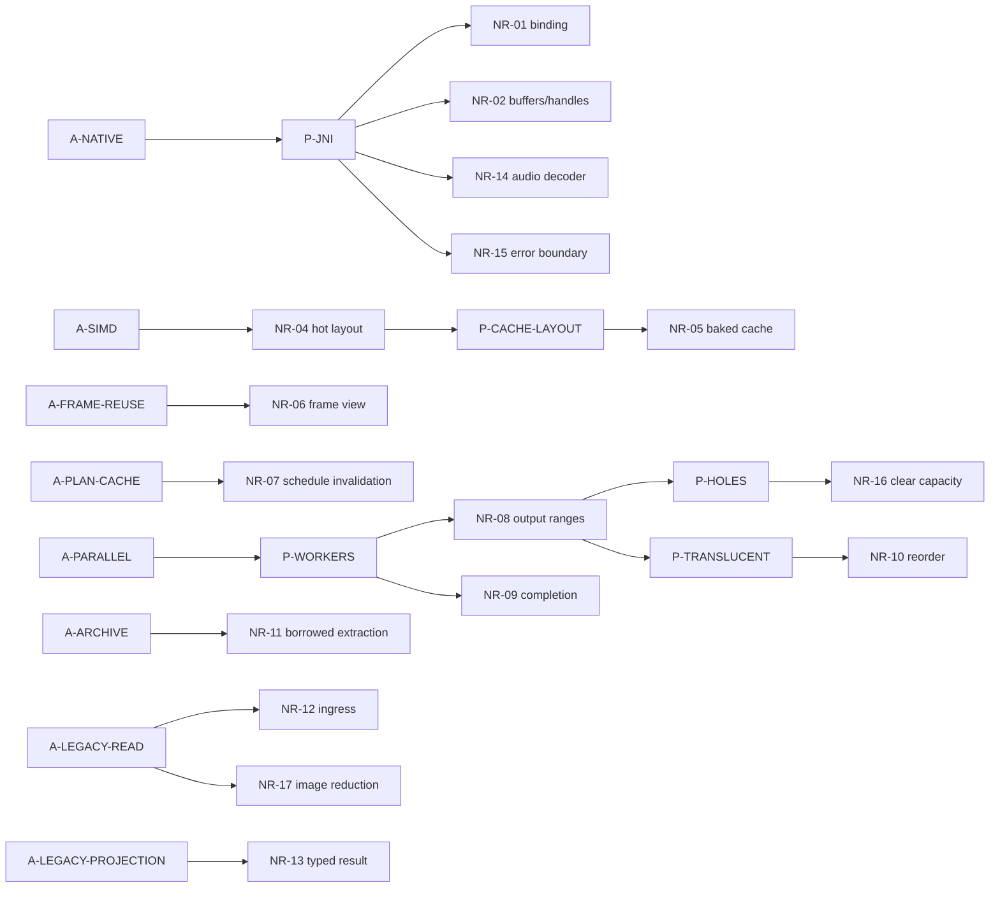

# 因果图与高扇出候选

本页拥有 NR 内部关系的唯一登记；跨子系统关系见[跨子系统关系](../governance/cross-subsystem-relations.md)，全局 R/D 排名见[全局高扇出候选](../governance/global-fanout.md)。

## 局部因果图

## 高扇出候选

| 候选 | 影响的本地机制 | 局部解释 |
|---|---|---|
| `A-NATIVE` | NR-01/02/14/15 | 绑定、地址/owner、音频 decoder 和错误收口是并列 ABI 义务 |
| `A-PARALLEL` | NR-08/09/10/16 | 固定区间与同 draw 汇合继续派生空洞和透明重排 |
| `A-SIMD` | NR-04/05 | 能力相关热布局要求 baked cache 按 profile 隔离 |
| `A-LEGACY-READ` | NR-12/17 | 有界 ingress 与图片峰值表示拥有不同失败边界 |
| `A-ONE-ARTIFACT/D-MIGRATION` | NR-13 | 单向迁移只保留 current payload 和整体 result owner |
| `A-ARCHIVE` | NR-11（并影响 AP-01） | 借用缓存减少分配的候选收益换来跨调用时间耦合 |

## 局部因果与删除边界

| 子图 | 附属关系 / 可消失前提 | 保留的独立义务与成本 |
|---|---|---|
| `A-NATIVE → P-JNI → NR-01/02/15` | 同一跨语言边界分别产生绑定、内存和失败交接；三者为并列义务 | 统一 descriptor 不消除地址寿命或异常隔离，renderer 的输出桥退出也不撤走 codec/archive/legacy 消费者 |
| `A-SIMD → NR-04 → P-CACHE-LAYOUT → NR-05` | 能力相关布局使派生物不能跨宽度复用；更换 canonical 存储表示可减少 cache profile 分裂 | 读取/重排工作和 cold load 成本可能上升，bake 正确性、exact 输入和资源限制仍在 |
| `A-PARALLEL → NR-08 → P-HOLES → NR-16` | 预留固定区间又提交容量，使未写槽需要清理；若改为提交紧凑实际范围，该附属补偿才可退出 | 输出不重叠、成功后提交及 NR-10 透明顺序仍有独立来源；compact/prefix-sum 也可能引入新同步 |
| `NR-08 → P-TRANSLUCENT → NR-10 → P-DRAW-REENTRY` | 分散透明输出需要整体暂存/重排，全局 scratch 再要求调用串行 | 现有调用串行是前提，不存在由本图证明的通用重入保护；并发 draw 需先核验 scratch 与 NR-09 executor 边界 |
| `A-FRAME-REUSE → NR-06`；`A-PLAN-CACHE → NR-07` | 原地帧 view 有效期与可见工作集缓存失效是两个选择，不能把二者压成“帧状态缓存” | 每帧重算 schedule 可去掉 NR-07 缓存，不能让旧 view 跨 extract 存活；pose-only 更新与等长成员替换需分别验证 |
| `A-ARCHIVE → NR-11 → P-BORROW → AP-01` | 借用缓存衍生 Java owning capture 的复制时点约束 | Copy 可迁移但不会自动消失；7z solid-block 算法成本和分阶段输入冻结分别保留 |
| `A-LEGACY-READ → P-LEGACY-IMAGE → NR-17` | 完整模型解码使 raw image representation 可能跨越剩余 parse 生命周期；提前按角色准备并复用已编码结果收缩峰值表示与重复工作 | NR-12 的 source/明文边界、NR-13 的 typed 结果 owner、AP-03 的 raw 失败回退均有独立删除条件 |

本地关系全集见下表；跨域关系由跨子系统页面唯一维护。Allocator/TLS 的 NR-03 独立保留为 Uncertain；legacy 的 source/明文边界、图片表示归约与结果 owner 分属读取、峰值表示和交付失败边界，不能按“都属于导入”合成一个节点。

## Fact 因果关系

| From | Type | To | Basis |
|---|---|---|---|
| A-IMAGE | requires | NR-17 | NR-17：legacy 图片按用途准备目标表示并验证交付 |
| C-JNI | requires | NR-15 | NR-15 |
| P-JNI | addresses | NR-01, NR-02, NR-14, NR-15 | 绑定、地址协议、音频 decoder handle、错误边界分别计数 |
| A-SIMD | creates | P-HOT-LAYOUT | NR-04 |
| P-HOT-LAYOUT | addresses | NR-04 | NR-04 |
| NR-04 | creates | P-CACHE-LAYOUT | NR-04/05：能力相关 baked 不可混用 |
| P-CACHE-LAYOUT | addresses | NR-05 | NR-05 |
| A-BAKED-CACHE | requires | NR-05 | NR-05 |
| A-FRAME-REUSE | creates | P-FRAME-VIEW | NR-06：原地覆盖使旧 view 失效 |
| P-FRAME-VIEW | addresses | NR-06 | NR-06 |
| A-PLAN-CACHE | creates | P-PLAN-STALE | NR-07：同长可见成员也可能变化 |
| P-PLAN-STALE | addresses | NR-07 | NR-07 |
| A-PARALLEL | creates | P-WORKERS | NR-08/09 |
| P-WORKERS | addresses | NR-08, NR-09 | 输出区间与依赖完成分别计数 |
| NR-08 | creates | P-HOLES, P-TRANSLUCENT | NR-16/10 |
| P-HOLES | addresses | NR-16 | 只为预留容量提交服务 |
| P-TRANSLUCENT | addresses | NR-10 | NR-10：分散任务结果需整体重排 |
| D-TRANSPARENCY | requires | NR-10 | NR-10：排序义务还有独立来源 |
| NR-10 | creates | P-DRAW-REENTRY | 全局透明 scratch 不可重入；当前依靠串行调用前提，未证明独立重入保护 |
| A-ARCHIVE | requires | NR-11 | NR-11 |
| A-LEGACY-READ | creates | P-SOURCE-READ | NR-12：Java 完整读取可能访问失败或短读，native exact-finish 可能拒绝不完整输入 |
| P-SOURCE-READ | addresses | NR-12 | NR-12 |
| A-LEGACY-READ | creates | P-LEGACY-IMAGE | NR-17：完整模型解码可能跨剩余 parse 生命周期保留 raw image representation 并重复编码 |
| P-LEGACY-IMAGE | addresses | NR-17 | NR-17 |
| A-LEGACY-PROJECTION | creates | P-LEGACY-RESULT | NR-13 |
| P-LEGACY-RESULT | addresses | NR-13 | NR-13 |
| A-ONE-ARTIFACT | requires | NR-13 | NR-13 |
| D-MIGRATION | requires | NR-13 | NR-13 |

## 非因果关系与候选扩展

| From | Relation / Confidence | To | 含义 |
|---|---|---|---|
| NR-09 | conflicts / Inference | D-LOOP | 等待存在为 Fact；同次 draw fork/join 是否包含于该条款待 Q-01 |
| H-ALLOCATOR | motivates / Hypothesis | NR-03 | 当前 allocator/TLS 故障前提待复现 |
