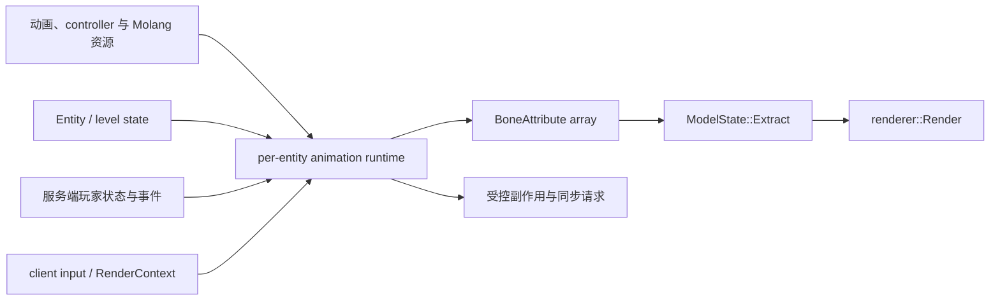

# 动画系统

YSM 的动画系统在客户端把 `Entity` / `level` 状态、服务端投影的玩家状态、客户端输入、`RenderContext` 和模型动画资源求值为逐骨骼 `BoneAttribute`，再交给 native renderer 执行 extract 和 render。Java 拥有动画语义与每 `entity` 运行时；游戏服务端只裁决和分发需要联网的状态或事件；native 不解析动画、controller 或 Molang。

## 设计目标

- 让模型动画、内建动作和联网状态进入同一套可组合的骨骼求值流程；
- 分离模型级只读资源、`entity` 级可变状态、逐次 `RenderContext` 和 native 逐帧输出；
- 支持 coded、Bedrock 与 hybrid controller，同时保留确定的状态转换、混合和覆盖顺序；
- 允许常规 `level` 中的 `entity` 提前求值，且不让异步执行破坏其生命周期或重复触发副作用；
- 把 Roaming 持久变量与 `ysm.sync` 瞬时事件分开，网络身份和权限仍由模型管理与协议层决定；
- 将模组联动限制为输入适配，不让可选依赖侵入动画状态机、网络权威或 renderer 生命周期。

## 主链

`BoneAttribute` 只描述骨骼局部旋转、位移、缩放、层级可见性、locator 标记以及逐骨骼颜色、透明度和发光覆盖；最终层级变换、可见几何、调度与顶点生成属于[渲染系统](rendering.md)。模型资源结构以 [Model Schema](../standards/model-schema/assets-and-validation.md) 及其 Proto 快照为准，联网状态与控制消息以 [当前网络协议](../standards/protocol-v1/README.md) 为准。

详细职责、状态与求值过程见[动画架构](../architecture/animation/README.md)。当前线程安全、语义完整性、联动模组和实机验证缺口见[动画已知问题](../status/known-issues/animation.md)。
