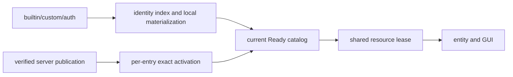

# 模型管理

模型管理把 builtin、local custom/auth 与当前 server session 提供的远端内容整理为不可变 catalog，并以 `ModelId` 识别模型。Java 拥有来源、目录、存储、会话和生命周期；native 只提供 hash、压缩、图片、bake 与 render 能力。

设计目标：

- Catalog 是唯一当前内容映射；路径和容器标识不成为业务身份。
- Local discovery worker 构造不可变 identity/content candidate，client/server owner 在各自游戏线程按当前 authority 原子提交。
- Remote full/delta 先提交只含 identity、path 与 access 的 authority；entry 通过 active/local/cache/server 取得并验证 exact representation 后，才以 Ready content 进入 current catalog。
- 同一精确资源共享一个 lease；旧、新 `ModelContent` 通过对象身份自然隔离。
- 长期内容由强引用和 Cleaner 管理；固定 owner 的短期大对象才手动关闭。
- Cache 只加速读取，不创造 catalog 可见性或授权。

完整实现边界见[模型管理架构](../architecture/model-management/README.md)，格式语义见 [Model Schema](../standards/model-schema/README.md)。
