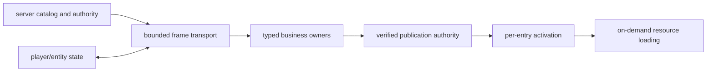

# 网络系统

YSM 在 Forge connection 上使用一条 `EventNetworkChannel`，同步模型 session、catalog、资产、玩家与 entity 状态以及控制事件。Server 是远端 catalog、grants、selection 和玩家状态的权威；client 只有在完整验证后才发布远端目录或资源。

设计目标：

- 一条当前 wire path，不保留旧 reader、双读或兼容 endpoint。
- Lean catalog authority 完整验证后原子切换；每个 exact representation 再经 active/local/cache/server 激活，普通资产按需请求、验证和缓存。
- 每个请求在 server admission 时重新检查 catalog 与授权；客户端缓存不构成 capability。
- 一个全局 dispatch owner 统一玩家 FIFO、公平、背压、重试与总限速。
- Frame transport 不拥有 transfer、resource key、assembly 或 completion。Collection full/delta、metadata prefix、model chunk 与 presentation fragment 分别由业务本地 owner 执行有界 coverage、terminal 与 publication。
- Exact Forge `Connection` 是 session、typed transfer 与迟到 work 的统一 retirement 边界；wire 不序列化第二种 connection identity。

当前 wire contract 见[当前网络协议](../standards/protocol-v1/README.md)，职责与运行时边界见[网络架构](../architecture/network/README.md)和[网络已知问题](../status/known-issues/network.md)。
